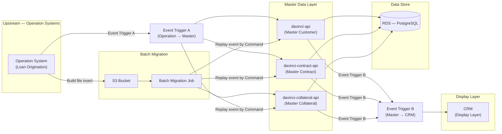
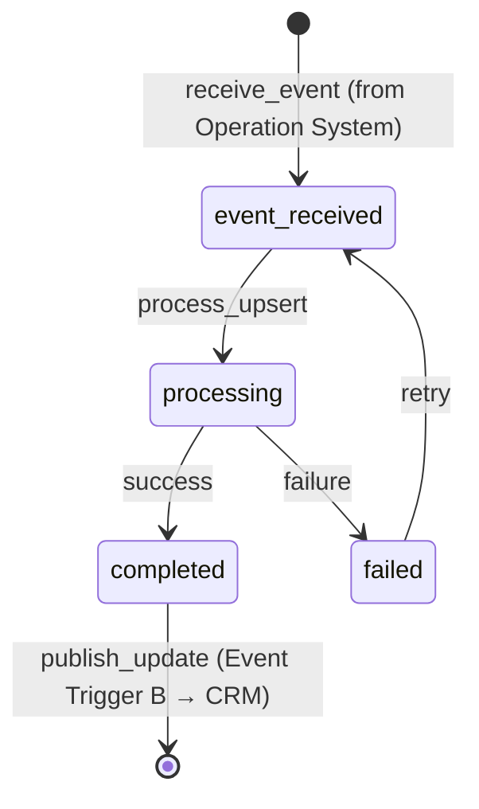
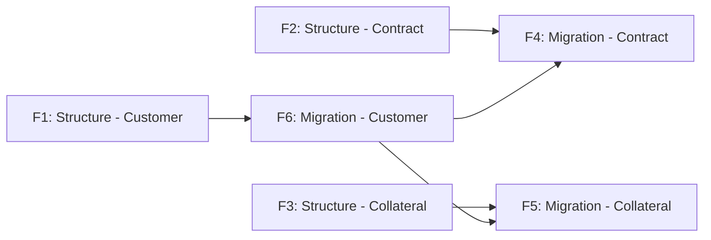

# Blueprint 879: Master Data Structure — Architecture

> **Project:** CreditMaster
> **Status:** Draft
> **Last Updated:** 2026-02-24
> **Prerequisites:** None (foundational master data layer)
> **BA Reference:** [Product Capabilities](./Product%20Capabilities.md)

---

## S1. Overview

This phase delivers a **centralized Master Data Layer** for Customer, Contract, and Collateral data — providing a single source of truth consumed by the CRM Display Layer. Scope boundary: UI/Screen changes on CRM are **not included** — CRM reads from master data via existing display layer; Operation System business logic changes are **not included** — Operation Systems remain upstream event producers. This also includes a **Batch Migration** mechanism for historical data backfill from Operation Systems to Master Data (RDS) via S3. This is the foundational phase — no prior blueprints exist for Master Data.

---

## S2. System Context



### Integration Points

| System | Role | Integration Method |
|--------|------|--------------------|
| **Operation System** | Upstream source of truth for loan origination events | Event Trigger A (event-based, async) |
| **davinci-api** | Master Customer data service | REST API + Event consumer/producer |
| **davinci-contract-api** | Master Contract data service | REST API + Event consumer/producer |
| **davinci-collateral-api** | Master Collateral data service | REST API + Event consumer/producer |
| **RDS (PostgreSQL)** | Persistent storage for all master data | Direct connection from each API |
| **CRM** | Display layer for end users | Consumes Event Trigger B (async) |
| **S3** | Staging area for batch migration files | File-based — Operation System writes, Batch Job reads |
| **Batch Migration Job** | Replays historical events into master data | Command-based replay → REST/Event to Master APIs |

---

## S3. Domain Model

```
Customer 1──* CustomerContract *──1 Contract
Customer 1──* CustomerCollateral *──1 Collateral
Contract *──* Collateral (via ContractCollateral)

Customer
├── CustomerAddress (1──*)
├── CustomerContact (1──*)
├── CustomerVerification (1──1)
├── CustomerBlacklist (1──*)
├── CustomerRisk (1──1)
└── CustomerAuditTrail (1──*)

Contract
├── ContractDisbursement (1──1)
├── ContractPaymentStatus (1──1)
├── ContractLitigation (1──*)
├── ContractHistory (1──*)  — Restructure, Topup, Pay to Close
├── ContractDocument (1──*)
└── ContractCollectionFee (1──*)

Collateral
├── CollateralDetail (1──1)  — Vehicle / Land specifics
├── CollateralRegistration (1──1)
├── CollateralBlacklist (1──*)
├── CollateralDamage (1──*)
├── CollateralImage (1──*)
├── CollateralAppraisal (1──*)
└── CollateralOwnership (1──*)
```

| Entity | Purpose |
|--------|---------|
| **Customer** | ข้อมูลหลักของลูกค้า ใช้เลขบัตรประชาชนเป็น Unique Key |
| **CustomerVerification** | สถานะผลตรวจสอบ DOPA ล่าสุด |
| **CustomerBlacklist** | รายการ Blacklist และระดับความเสี่ยง |
| **CustomerAuditTrail** | ประวัติการเปลี่ยนแปลงข้อมูลสำคัญ (สถานะสมรส, ที่อยู่) |
| **Contract** | สัญญาเงินกู้แต่ละฉบับ รวมเงื่อนไข Principal, Rate, Tenor |
| **ContractPaymentStatus** | สถานะการชำระหนี้ Real-time (Balance, DPD, Interest/Principal Paid) |
| **ContractLitigation** | ข้อมูลดำเนินคดี (เลขคดีแดง/ดำ, วันพิพากษา, Write-off) |
| **ContractHistory** | ประวัติ Restructure, Topup, Pay to Close เชื่อมโยงกับสัญญาเดิม |
| **ContractDocument** | Link/Reference เอกสารประกอบ (ID Card, Transfer Form, Insurance) |
| **Collateral** | ข้อมูลหลักของหลักประกัน แยกตามประเภท (รถยนต์, มอเตอร์ไซค์, แทรกเตอร์, ที่ดิน) |
| **CollateralRegistration** | ข้อมูลทะเบียน, วันจดทะเบียน, Tax Expiry |
| **CollateralDamage** | ข้อมูลความเสียหาย (Deduction/Damage) สำหรับ Ratebook |
| **CollateralBlacklist** | ผลตรวจสอบบัญชีดำ ระดับความรุนแรงและสาเหตุ |
| **CollateralImage** | รูปภาพหลักประกันเพื่อใช้เป็นหลักฐาน |

---

## S4. Workflow / State Machine Changes

### Master Data Event Processing States

| State | Description | Actor |
|-------|-------------|-------|
| `event_received` | Event ถูกรับจาก Operation System (Event Trigger A) | System |
| `processing` | กำลังประมวลผลและ upsert ข้อมูลลง Master Data | System |
| `completed` | ข้อมูล upsert สำเร็จ พร้อมส่ง Event Trigger B | System |
| `failed` | ประมวลผลล้มเหลว รอ retry | System |

### Actions

| Action | Triggered By |
|--------|--------------|
| `receive_event` | System (Event Trigger A from Operation System) |
| `process_upsert` | System (Master Data API) |
| `publish_update` | System (Event Trigger B to CRM) |
| `retry_failed` | System (retry mechanism) |

### Transition Table

| From | Action | To |
|------|--------|----|
| — | `receive_event` | `event_received` |
| `event_received` | `process_upsert` | `processing` |
| `processing` | (success) | `completed` |
| `processing` | (failure) | `failed` |
| `completed` | `publish_update` | (terminal — event sent to CRM) |
| `failed` | `retry_failed` | `event_received` |

### State Diagram



---

## S5. Key Flows

#### Flow 1: Real-time Event Update (Operation System → Master Data → CRM)

**Trigger:** Operation System เกิดเหตุการณ์ที่เปลี่ยนแปลงข้อมูล (เช่น สร้างสัญญา, อัปเดตข้อมูลลูกค้า, เปลี่ยนสถานะการชำระ)
**Systems:** Operation System → Event Trigger A → Master Data API → RDS → Event Trigger B → CRM

1. Operation System publishes event via Event Trigger A (ระบุ domain: customer/contract/collateral)
2. Master Data API (davinci) receives event, validates payload
3. Master Data API upserts data to RDS (insert if new, update if exists by unique key)
4. Master Data API updates relevant flags based on event type
5. Master Data API publishes Event Trigger B to notify CRM of data change
6. CRM receives event and updates display

**Transaction boundaries:** Steps 3-4 atomic (single PG transaction). Step 5 is after commit (at-least-once delivery).
**Failure:** If step 3 fails, event is retried. If step 5 fails, outbox pattern ensures eventual delivery.

#### Flow 2: Customer OTP Verification / Contact Update

**Trigger:** ลูกค้ายืนยัน OTP หรือเปลี่ยนที่อยู่ติดต่อในกระบวนการขาย
**Systems:** Operation System → Event Trigger A → davinci-api → RDS → Event Trigger B → CRM

1. Operation System sends `customer.contact_updated` event with verified phone/address
2. davinci-api receives event, locates customer by National ID (unique key)
3. davinci-api updates contact info and creates audit trail entry — PG transaction
4. davinci-api publishes `customer.updated` event to CRM

**Transaction boundaries:** Step 3 atomic (PG transaction).
**Failure:** If customer not found, event is logged and sent to dead letter queue for investigation.

#### Flow 3: Batch Migration (S3 → Master Data)

**Trigger:** Batch job triggered by folder name (start date - end date)
**Systems:** Operation System → S3 → Batch Job → Master Data APIs → RDS

1. Operation System builds migration file and inserts to S3 (organized by date folders)
2. Batch job starts, reads files from S3 folder matching date range
3. Batch job replays events by Command — sends upsert requests to Master Data APIs
4. Master Data APIs process each event as normal upsert to RDS
5. Progress and errors are logged for reconciliation

**Transaction boundaries:** Each event replay is an independent transaction (step 4). Batch job is not atomic — partial completion is acceptable.
**Failure:** Failed individual events are logged with error details. Batch job continues processing remaining events. Failed events can be retried independently.

#### Flow 4: Contract Lifecycle Event (Restructure / Topup / Pay to Close)

**Trigger:** Operation System processes contract lifecycle change
**Systems:** Operation System → Event Trigger A → davinci-contract-api → RDS → Event Trigger B → CRM

1. Operation System sends lifecycle event (e.g., `contract.restructured`, `contract.topup`, `contract.pay_to_close`)
2. davinci-contract-api receives event, locates contract by contract number
3. davinci-contract-api creates ContractHistory entry linked to original contract
4. davinci-contract-api updates contract status and relevant fields — PG transaction
5. davinci-contract-api publishes update event to CRM

**Transaction boundaries:** Steps 3-4 atomic (PG transaction).
**Failure:** If contract not found, event is dead-lettered. If PG transaction fails, event is retried.

---

## S6. API Contracts (Cross-System)

### Event Trigger A (Operation System → Master Data)

| Field | Description |
|-------|-------------|
| Endpoint | Event-based (message queue) |
| Purpose | Deliver data change events from Operation System to Master Data |
| Direction | Operation System → davinci-api / davinci-contract-api / davinci-collateral-api |
| Auth | Service-to-service authentication |
| Key fields | `eventType` (string), `domain` (customer/contract/collateral), `entityId` (string), `payload` (object), `timestamp` (ISO-8601), `sourceSystem` (string) |
| Error contract | Consumer acknowledges after successful processing. Failed events are retried with exponential backoff. Dead letter after max retries. |

### Event Trigger B (Master Data → CRM)

| Field | Description |
|-------|-------------|
| Endpoint | Event-based (message queue) |
| Purpose | Notify CRM of master data changes for display update |
| Direction | davinci-api / davinci-contract-api / davinci-collateral-api → CRM |
| Auth | Service-to-service authentication |
| Key fields | `eventType` (string), `domain` (customer/contract/collateral), `entityId` (string), `changedFields` (array), `timestamp` (ISO-8601) |
| Error contract | At-least-once delivery. CRM must be idempotent. |

### Batch Migration Command

| Field | Description |
|-------|-------------|
| Endpoint | Command-based (CLI or scheduled job) |
| Purpose | Replay historical events from S3 files into master data |
| Direction | Batch Job → Master Data APIs |
| Auth | Service account with migration role |
| Key fields | `s3FolderPath` (string), `startDate` (date), `endDate` (date), `domain` (customer/contract/collateral), `batchSize` (int) |
| Error contract | Per-event error logging. Failed events written to error report. Non-blocking — batch continues on individual failure. |

---

## S7. Side Effect Map

| Trigger | DB Changes | Messages Published | External Calls | Notes |
|---------|-----------|-------------------|----------------|-------|
| Customer event (create/update) | RDS: upsert Customer + related entities | Event Trigger B: `customer.updated` | — | PG transaction |
| Customer OTP verified | RDS: update CustomerContact, insert AuditTrail | Event Trigger B: `customer.contact_updated` | — | PG transaction |
| Customer DOPA check result | RDS: update CustomerVerification | Event Trigger B: `customer.verification_updated` | — | PG transaction |
| Contract event (create) | RDS: insert Contract + Disbursement + PaymentStatus | Event Trigger B: `contract.created` | — | PG transaction |
| Contract payment update | RDS: update ContractPaymentStatus (Balance, DPD) | Event Trigger B: `contract.payment_updated` | — | PG transaction |
| Contract lifecycle (Restructure/Topup/PTC) | RDS: insert ContractHistory, update Contract | Event Trigger B: `contract.lifecycle_changed` | — | PG transaction |
| Contract litigation update | RDS: upsert ContractLitigation | Event Trigger B: `contract.litigation_updated` | — | PG transaction |
| Collateral event (create/update) | RDS: upsert Collateral + Detail + Registration | Event Trigger B: `collateral.updated` | — | PG transaction |
| Collateral blacklist check | RDS: upsert CollateralBlacklist | Event Trigger B: `collateral.blacklist_updated` | — | PG transaction |
| Collateral damage assessment | RDS: upsert CollateralDamage | Event Trigger B: `collateral.damage_updated` | — | PG transaction |
| Batch migration (per event) | RDS: upsert based on event type | — (no Event Trigger B during migration) | — | Independent PG transaction per event |
| Batch migration (complete) | — | Migration completion report | — | Logged for reconciliation |

---

## S8. Architecture Decisions

| # | Decision | Options Considered | Chosen | Rationale |
|---|----------|-------------------|--------|-----------|
| 1 | Master Data storage engine | MongoDB (document) / PostgreSQL (RDS) | **PostgreSQL (RDS)** | Structured relational data with strong consistency requirements. Supports complex joins for cross-entity queries. RDS managed service reduces operational burden. |
| 2 | Real-time update mechanism | Polling / Webhook / Event-based (message queue) | **Event-based (message queue)** | Decouples Operation System from Master Data. Supports retry and dead letter. Scales independently. |
| 3 | Batch migration approach | Direct DB-to-DB migration / ETL pipeline / Event replay via S3 | **Event replay via S3** | Reuses existing event processing logic (same upsert path). S3 provides durable staging. Supports date-range selective migration. |
| 4 | Customer unique key | Auto-increment ID / UUID / National ID | **National ID (เลขบัตรประชาชน)** | Business requirement — single customer record per citizen. Prevents duplicate customer records across systems. |
| 5 | Audit trail approach | Separate audit table / CDC (Change Data Capture) / Application-level audit | **Application-level audit table** | Fine-grained control over what changes are tracked. Supports business-meaningful descriptions. Simpler to query for compliance reporting. |
| 6 | Migration event delivery to CRM | Publish Event Trigger B during migration / Skip Event Trigger B | **Skip Event Trigger B during migration** | Batch migration would flood CRM with events. CRM does a full refresh after migration completes. Reduces system load during migration window. |

---

## S9. Error Handling, Resilience & Observability

### Failure Scenarios

| Failure Scenario | System | Expected Behavior | Recovery |
|-----------------|--------|-------------------|----------|
| Event Trigger A message malformed | Master Data API | Reject event, log error with payload | Manual fix and replay. Dead letter queue for investigation. |
| RDS unavailable | Master Data API | Event processing paused, messages stay in queue | Automatic retry when RDS recovers. No data loss due to queue persistence. |
| Duplicate event received | Master Data API | Idempotent upsert — no duplicate records | By design (upsert by unique key) |
| Event Trigger B publish fails | Master Data API | Data saved to RDS but CRM not notified | Outbox pattern: poll for unpublished events and retry |
| S3 file corrupted during migration | Batch Job | Skip corrupted file, log error | Manual investigation. Re-upload file and retry. |
| Batch migration partially fails | Batch Job | Continue processing remaining events | Error report lists failed events. Retry failed events independently. |
| Customer not found for update event | davinci-api | Event rejected | Dead letter queue. May indicate out-of-order events — create customer first. |
| Contract/Collateral reference not found | davinci APIs | Event rejected | Dead letter queue. Dependency must be created first. |

### Observability

**Metrics:**
- Event processing throughput (events/sec per domain)
- Event processing latency (p50, p95, p99)
- Error rate per event type
- Queue depth per domain (Event Trigger A)
- Batch migration progress (% complete, events/sec)
- RDS connection pool utilization

**Structured logging fields:**
- `eventId`, `eventType`, `domain`, `entityId`, `sourceSystem`, `processingTimeMs`, `status` (success/failed), `errorCode`, `batchId` (for migration)

**Alerts:**
- Event processing error rate > 5% for > 5 minutes
- Queue depth > 10,000 for > 10 minutes (possible consumer failure)
- RDS connection pool > 80% utilization
- Batch migration error rate > 1% (data quality issue)
- Event Trigger B publish failure rate > 1%

---

## S10. Non-Functional Requirements

| Aspect | Requirement | Rationale |
|--------|------------|-----------|
| Event processing latency | < 500ms per event (p95) | Near real-time data availability on CRM |
| Event Trigger B latency | < 2s after master data commit | CRM display should update promptly |
| Batch migration throughput | > 1,000 events/sec | Complete historical migration within maintenance window |
| Data consistency | Upsert must be idempotent | Retry-safe, no duplicate records |
| Data retention | Master data: indefinite. Audit trail: 5 years | Business + compliance requirement |
| Availability | Queue-based — downtime = delayed, not lost | Event persistence in message queue guarantees no data loss |
| RDS storage | Support 10M+ customer, 50M+ contract, 20M+ collateral records | Projected data volume for 5 years |

---

## S11. Feature Decomposition

| # | Feature | Scope Summary | Architecture Constraints | Delegated Decisions |
|---|---------|--------------|------------------------|-------------------|
| F1 | Structure - Customer | Master Customer schema, event processing, audit trail | National ID as unique key. Must store DOPA/Blacklist/Risk status. Must create audit trail on key field changes. Must link to Contract and Collateral. | Column types, index strategy, audit trail detail level |
| F2 | Structure - Contract | Master Contract schema, payment status, litigation, documents | Must store Principal/Rate/Tenor. Must track DPD real-time. Must link to original contract for Restructure/Topup/PTC. Must store document references. | Payment calculation logic, document storage format, DPD calculation rules |
| F3 | Structure - Collateral | Master Collateral schema per type (vehicle/land), blacklist, damage, images | Must support 4 collateral types (car, motorcycle, tractor, land). Must store registration + tax expiry. Must store images. | Image storage strategy, type-specific field organization, appraisal workflow |
| F4 | Migration - Contract | Batch migrate contract data from Operation System to RDS | S3-based file staging. Event replay via Command. Per-event independent transaction. Skip Event Trigger B during migration. | File format, batch size, error threshold, migration scheduling |
| F5 | Migration - Collateral | Batch migrate collateral data from Operation System to RDS | Same as F4 constraints. | Same as F4 delegated decisions. |
| F6 | Migration - Customer | Batch migrate customer data from Operation System to RDS | Same as F4 constraints. Customer must be migrated before Contract/Collateral (dependency). | Same as F4 delegated decisions. |

---

## S12. Development Phases



**Dependencies:**
- **F1, F2, F3 (Structure)** can be developed **in parallel** — they are independent schemas
- **F6 (Migration - Customer)** must complete before F4 and F5 — Customer data is referenced by Contract and Collateral
- **F4, F5 (Migration - Contract, Collateral)** can run **in parallel** after F6 completes
- Each Structure feature must be complete before its corresponding Migration feature can begin
