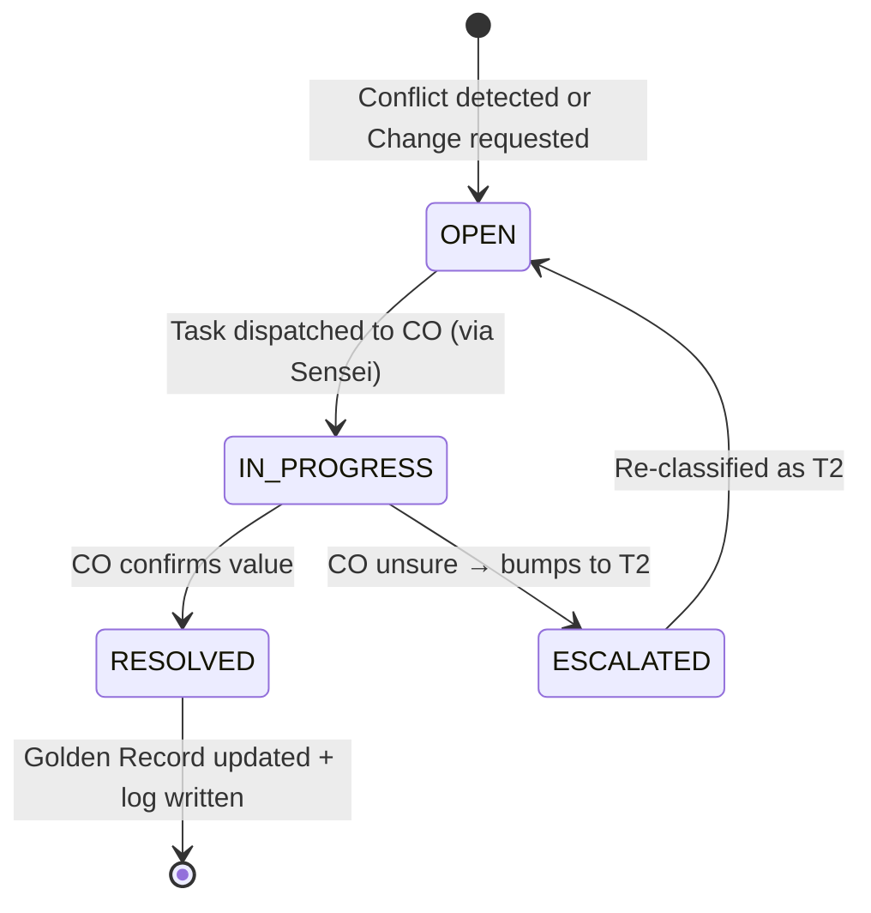
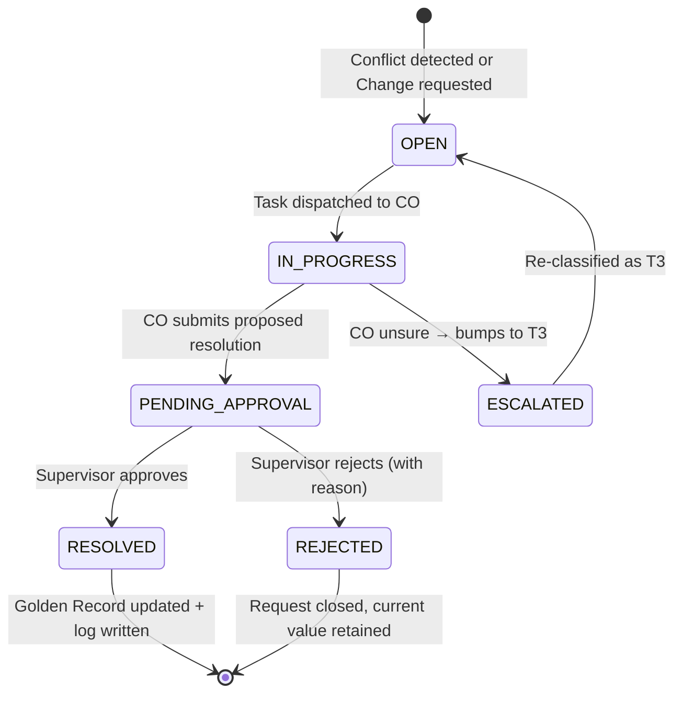
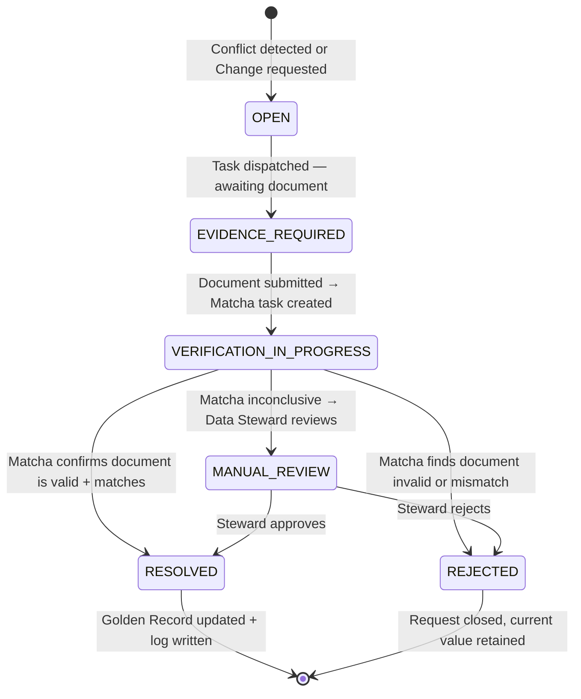

# Capability Exploration: Customer Data Consolidation Engine

> **Date**: 2026-02-24
> **Author**: @ARCHITECT
> **Status**: 🔍 Exploration (Pre-ADR)
> **Product**: DaVinci (data ownership) + Sensei (operational consumer)

---

## 1. First Principles Inquiry

### Why does this need to exist?

DaVinci receives customer data from **multiple upstream sources** — each authoritative for different slices of the same customer:

| Source System | Authoritative For | Example Data |
|--------------|-------------------|-------------|
| **Operation System (LOS)** | Loan application data | Name, address at origination, employer, income |
| **Core Banking** | Active loan data | Balances, DPD, payment history |
| **Policy Admin** | Insurance data | Policy status, premium payments, beneficiaries |
| **KYC/Matcha** | Verification status | DOPA result, document verification status |
| **Onigiri (LOS)** | Application pipeline | New applications, profile updates during origination |
| **CRM (legacy)** | Historical contact data | Phone numbers, addresses entered by branch staff |

**The core problem:** When multiple sources send data about the **same customer**, they may:

1. **Conflict** — Source A says phone is `081-XXX-1111`, Source B says `081-XXX-2222`. Which wins?
2. **Overlap partially** — Source A has a Thai name, Source B has an English name. Both are valid.
3. **Arrive out of order** — A newer event may be processed before an older one due to queue timing.
4. **Contain stale data** — CRM has an address from 2019; LOS has one from 2026. But CRM's might be the customer's home address while LOS's is their work address.

Without explicit consolidation logic, the system either:
- **Last-write-wins** → loses data silently (❌ violates no-data-loss)
- **Rejects conflicts** → creates manual work backlog that never gets resolved
- **Keeps everything** → produces an incoherent record no one trusts

### What problem does this solve at the most basic level?

**Deterministic, auditable assembly of a single customer record from multiple partial inputs — with zero data loss and the ability to prove it.**

### Assumptions Challenged

| Assumption | Challenge | Verdict |
|-----------|-----------|---------|
| "One source is always right" | Different sources are authoritative for different fields. LOS knows the origination address; Core Banking knows the current balance. | ❌ Rejected. Authority is **field-level**, not source-level. |
| "Latest timestamp wins" | A CRM entry from 2024 might be the correct *home* address even when LOS has a 2026 *work* address. | ❌ Rejected. Recency alone is insufficient — type-awareness matters. |
| "Conflicts are rare" | In multi-subsidiary, multi-product environments, the same customer appears in 3-5 systems. | ❌ Rejected. Conflicts are **routine**, not exceptional. |
| "We can resolve everything automatically" | Some conflicts require human judgment (e.g., two different National IDs for what appears to be the same person). | ✅ Accepted. The system must support both auto-resolution and human escalation. |

---

## 2. Capability Design: Consolidation Engine

### Core Concept

The Consolidation Engine is a **rules-based data assembly pipeline** that runs every time DaVinci receives a data event for a customer. Instead of a simple upsert, it:

1. **Receives** a data fragment from a source
2. **Compares** the fragment against the current Golden Record
3. **Applies resolution rules** to decide what to accept, merge, or flag
4. **Writes** the result AND the reasoning to the Golden Record
5. **Self-checks** the output for integrity

### 2.1 Resolution Strategy: Field-Level Source Authority

Each field in the Golden Record has a **ranked list of authoritative sources**. When a conflict arises, the source with higher authority for that specific field wins — unless the lower-authority source has a more recent timestamp AND the field is not authority-locked.

```
Field Authority Matrix (example):

┌─────────────────────┬───────────┬───────────┬──────────┬─────────┐
│ Field               │ Rank 1    │ Rank 2    │ Rank 3   │ Rank 4  │
├─────────────────────┼───────────┼───────────┼──────────┼─────────┤
│ National ID         │ KYC/DOPA  │ LOS       │ —        │ —       │ 🔒 Authority-locked
│ Name (TH)           │ KYC/DOPA  │ LOS       │ CRM      │ —       │
│ Name (EN)           │ KYC/DOPA  │ LOS       │ CRM      │ —       │
│ DOB                 │ KYC/DOPA  │ LOS       │ —        │ —       │ 🔒 Authority-locked
│ Phone (primary)     │ CRM       │ LOS       │ Core BK  │ —       │
│ Phone (secondary)   │ CRM       │ LOS       │ —        │ —       │
│ Address (home)      │ CRM       │ LOS       │ —        │ —       │
│ Address (work)      │ LOS       │ CRM       │ —        │ —       │
│ KYC Status          │ KYC/DOPA  │ —         │ —        │ —       │ 🔒 Authority-locked
│ Loan Balance        │ Core BK   │ —         │ —        │ —       │ 🔒 Authority-locked
│ Policy Status       │ Policy    │ —         │ —        │ —       │ 🔒 Authority-locked
│ Employer            │ LOS       │ CRM       │ —        │ —       │
│ Income              │ LOS       │ —         │ —        │ —       │ 🔒 Authority-locked
└─────────────────────┴───────────┴───────────┴──────────┴─────────┘
```

**Resolution rules:**

| Scenario | Rule | Outcome |
|----------|------|---------|
| New field, no existing value | **Accept** | Write the value. Log as `INITIAL_SET`. |
| Same value from different source | **Confirm** | Keep value, update `last_confirmed_at`. Log as `CONFIRMED`. |
| Different value, incoming source has higher authority | **Override** | Replace value. Archive previous value. Log as `AUTHORITY_OVERRIDE`. |
| Different value, incoming source has lower authority | **Store as alternative** | Keep current value. Store incoming as `alternative_value`. Log as `LOWER_AUTHORITY_STORED`. |
| Different value, same authority rank | **Escalate** | Flag for human review. Log as `CONFLICT_ESCALATED`. |
| Authority-locked field, any source below Rank 1 | **Reject override** | Keep current value. Log as `AUTHORITY_LOCKED_REJECTED`. |
| Out-of-order event (event timestamp < last processed timestamp) | **Evaluate** | Apply rules but log as `OUT_OF_ORDER_PROCESSED`. Self-check triggers. |

### 2.2 No-Data-Loss Guarantee

> [!IMPORTANT]
> **No incoming data is ever discarded.** Every data fragment is preserved — either in the Golden Record, as an alternative value, or in the consolidation log.

The guarantee is implemented through three mechanisms:

**Mechanism 1: Every incoming value is persisted before resolution**

```
Incoming Event → Raw Event Store (append-only) → Consolidation Engine → Golden Record
                        ↑                                                      ↑
                   Never deleted                                        Resolution result
```

The **Raw Event Store** is an append-only log of every data event received by DaVinci, stored verbatim with:
- `event_id`, `source_system`, `received_at`, `event_timestamp`, `payload_hash` (SHA-256), `raw_payload`

**Mechanism 2: Superseded values are archived, not deleted**

When a Golden Record field is updated, the previous value moves to a `FieldHistory` table:
- `customer_id`, `field_name`, `previous_value`, `new_value`, `changed_at`, `source_system`, `resolution_type`, `consolidation_log_id`

**Mechanism 3: Alternative values are stored alongside the primary**

When a lower-authority source provides a different value, it is stored in an `AlternativeValue` table:
- `customer_id`, `field_name`, `alternative_value`, `source_system`, `received_at`, `status` (`pending_review` | `acknowledged` | `promoted`)

An alternative value can be **promoted** to the Golden Record via the Change Request workflow (ATLAS Capability 4).

### 2.3 Consolidation Log (Audit Trail)

Every consolidation decision produces an immutable log entry:

| Field | Description |
|-------|-------------|
| `log_id` | UUID |
| `customer_id` | Target customer |
| `event_id` | Triggering event (links to Raw Event Store) |
| `field_name` | Field being consolidated |
| `source_system` | Event source |
| `resolution_type` | `INITIAL_SET`, `CONFIRMED`, `AUTHORITY_OVERRIDE`, `LOWER_AUTHORITY_STORED`, `CONFLICT_ESCALATED`, `AUTHORITY_LOCKED_REJECTED`, `OUT_OF_ORDER_PROCESSED` |
| `previous_value` | Value before (null if first set) |
| `incoming_value` | Value from event |
| `resolved_value` | Value written to Golden Record |
| `authority_rank` | Authority rank of the source for this field |
| `rule_applied` | Human-readable rule description |
| `created_at` | Timestamp |

This log serves dual purposes:
1. **Compliance audit** — regulators can trace how any field arrived at its current value
2. **Debugging** — when a value looks wrong, the log shows exactly why it was set

### 2.4 Self-Check Mechanism

> [!IMPORTANT]
> **Self-check** is a post-consolidation verification layer that validates the Golden Record's integrity after every write. It catches bugs in resolution logic, corrupted writes, and consistency violations.

#### Checks Run After Every Consolidation

| Check | What It Validates | On Failure |
|-------|-------------------|------------|
| **Hash verification** | SHA-256 of resolved values matches what was written to DB | 🔴 CRITICAL — halt processing, alert ops |
| **Field completeness** | Required fields are not null after consolidation | 🟡 WARNING — log, continue |
| **Log-record consistency** | Golden Record field value matches the latest `resolved_value` in the consolidation log | 🔴 CRITICAL — flag for investigation |
| **Source count** | Customer has data from at least 1 source after consolidation | 🟡 WARNING — may indicate orphan record |
| **Temporal consistency** | `last_updated_at` on field is ≥ previous `last_updated_at` | 🟡 WARNING — may indicate out-of-order processing |

#### Periodic Batch Self-Check (Scheduled)

A batch process runs nightly to validate the entire dataset:

| Check | What It Validates | Scale |
|-------|-------------------|-------|
| **Golden Record ↔ Log Reconciliation** | Replay all consolidation logs for a customer and verify the result matches the current Golden Record fields | Sampled: 1% of customers per night (rolling full check over ~3 months) |
| **Raw Event completeness** | Every event in the Raw Event Store has a corresponding consolidation log entry | Full scan |
| **Alternative value staleness** | Alternative values older than 90 days with `pending_review` status are flagged for supervisor attention | Full scan |
| **Cross-field consistency** | Business rules (e.g., if `KYC_status = VERIFIED`, then `kyc_verified_date` must not be null) | Full scan |

Self-check results are published as a **Data Quality Report** — surfaced in:
- DaVinci's operational dashboard (for data stewards)
- Sensei's Supervisor Exception Panel (for items requiring branch action)

---

## 3. Conflict Classification & Resolution Tiers

> [!IMPORTANT]
> Every field in the authority matrix carries a **conflict classification** that determines which resolution workflow runs when a conflict is detected. This is the routing layer between "conflict detected" and "conflict resolved."

### 3-Tier Classification

Each field (or field group) is assigned one of three conflict resolution tiers:

| Tier | Name | When to Use | Resolver | SLA |
|------|------|-------------|----------|-----|
| **T1** | 🟢 **CO Handle** | Low-risk, verifiable during normal work (e.g., phone number, secondary address) | CO assigned to the customer's active playbook, or the customer's main responsible branch | Same day |
| **T2** | 🟡 **Needs Approval** | Medium-risk, affects downstream systems or compliance (e.g., name change, employer, marital status) | CO submits → Branch Supervisor or Data Steward approves | 3 business days |
| **T3** | 🔴 **Needs Verification** | High-risk, identity-affecting fields requiring evidence (e.g., National ID, DOB, KYC status) | Evidence submitted → Matcha verifies document → DaVinci accepts result | 5 business days |

### Field-to-Tier Mapping (extends the Authority Matrix)

```
┌─────────────────────┬────────┬─────────────────────────────────────────────┐
│ Field               │ Tier   │ Resolution Path                             │
├─────────────────────┼────────┼─────────────────────────────────────────────┤
│ Phone (primary)     │ T1 🟢  │ CO confirms during next call                │
│ Phone (secondary)   │ T1 🟢  │ CO confirms during next call                │
│ Address (home)      │ T1 🟢  │ CO confirms via customer, or during visit   │
│ Address (work)      │ T1 🟢  │ CO confirms via customer                    │
│ Email               │ T1 🟢  │ CO confirms via customer                    │
│ Employer            │ T2 🟡  │ CO submits → Supervisor approves            │
│ Marital Status      │ T2 🟡  │ CO submits → Supervisor approves            │
│ Name (TH)           │ T2 🟡  │ CO submits → Supervisor approves            │
│ Name (EN)           │ T2 🟡  │ CO submits → Supervisor approves            │
│ Income              │ T2 🟡  │ CO submits evidence → Supervisor approves   │
│ National ID         │ T3 🔴  │ Submit ID doc → Matcha verifies → Accept    │
│ DOB                 │ T3 🔴  │ Submit ID doc → Matcha verifies → Accept    │
│ KYC Status          │ T3 🔴  │ DOPA re-check → Matcha verifies → Accept    │
│ Passport            │ T3 🔴  │ Submit passport → Matcha verifies → Accept  │
└─────────────────────┴────────┴─────────────────────────────────────────────┘
```

> [!NOTE]
> The tier mapping is configurable via the DaVinci admin page (see Section 5). New fields inherit a default tier of T2 until explicitly classified.

---

## 4. Data Resolution Workflow (DaVinci-Owned)

> [!IMPORTANT]
> DaVinci owns the **entire resolution lifecycle** — not just the data, but the process. Sensei acts as a **task executor** (dispatching work to COs), but DaVinci tracks resolution state, enforces SLA, and records outcomes.

### 4.1 Unified Resolution Request

Both **system-detected conflicts** and **customer-initiated change requests** enter the same workflow. The trigger differs, but the resolution path is identical:

| Trigger | Source | Example | Entry Point |
|---------|--------|---------|-------------|
| **System conflict** | Consolidation Engine detects mismatch | LOS sends phone `081-111-2222`, CRM has `081-333-4444` | Auto-created `ResolutionRequest` |
| **Customer change request** | Customer contacts call center or branch | "I moved — please update my address" | Call center / branch staff creates `ResolutionRequest` via DaVinci API |
| **Data quality alert** | Self-check finds inconsistency | `KYC_status = VERIFIED` but `kyc_verified_date` is null | Auto-created `ResolutionRequest` |

### 4.2 ResolutionRequest Entity

| Field | Description |
|-------|-------------|
| `request_id` | UUID |
| `customer_id` | Target customer |
| `field_name` | Field(s) being resolved |
| `conflict_tier` | `T1`, `T2`, `T3` — from field classification |
| `trigger_type` | `SYSTEM_CONFLICT`, `CUSTOMER_CHANGE_REQUEST`, `DATA_QUALITY_ALERT` |
| `current_value` | Value in Golden Record |
| `proposed_value` | Incoming / requested value |
| `source_system` | Origin of the proposed value (or `CUSTOMER_DIRECT` for change requests) |
| `status` | `OPEN` → `IN_PROGRESS` → `RESOLVED` / `REJECTED` |
| `assigned_to` | CO / Supervisor / Matcha (depends on tier) |
| `responsible_branch_id` | The customer's main responsible branch |
| `evidence_ref` | Link to uploaded document or Matcha verification task (T3) |
| `resolution_outcome` | `ACCEPTED`, `REJECTED`, `MERGED`, `ESCALATED` |
| `resolved_by` | User or system that resolved |
| `resolved_at` | Timestamp |
| `consolidation_log_id` | Links to the Consolidation Log entry that triggered this |
| `sla_deadline` | Calculated from tier (T1: same day, T2: 3 days, T3: 5 days) |

### 4.3 Resolution Workflows per Tier

#### Tier 1 — 🟢 CO Handle



**How it works:**
1. DaVinci creates `ResolutionRequest` (T1)
2. DaVinci publishes `customer.resolution_required` event
3. Sensei picks up event → creates a `📋 Admin` task for the CO assigned to the customer (or the customer's main responsible branch)
4. CO contacts customer (during their next scheduled call or visit) and confirms the correct value
5. CO records outcome on the task → Sensei sends `customer.resolution_completed` event back to DaVinci
6. DaVinci updates Golden Record, archives previous value, writes Consolidation Log

**Customer change request variant:** Call center team receives a customer call → creates the `ResolutionRequest` via a DaVinci API endpoint → same flow from step 2 onward, except the call center can pre-fill the proposed value from the conversation.

#### Tier 2 — 🟡 Needs Approval



**How it works:**
1. DaVinci creates `ResolutionRequest` (T2)
2. Sensei creates task for CO → CO investigates and submits a proposed value with supporting notes
3. Task routes to **Branch Supervisor** (via Sensei's existing approval mechanism) or **Data Steward** for approval
4. Supervisor reviews CO's submission → approves or rejects
5. On approval → DaVinci updates Golden Record
6. On rejection → request is closed, current value retained, reason logged

#### Tier 3 — 🔴 Needs Verification



**How it works:**
1. DaVinci creates `ResolutionRequest` (T3)
2. Sensei creates task: the CO or call center collects a **supporting document** (ID card photo, passport scan, etc.)
3. Document is uploaded → DaVinci creates a **Matcha verification task** (`documentTypeKey` determined by field type — e.g., National ID → `THAI_NATIONAL_ID`)
4. Matcha verifies the document (automated via Wasabi AI + human review as needed)
5. Matcha returns result → DaVinci evaluates:
   - ✅ Document valid + data matches proposed value → `RESOLVED`, Golden Record updated
   - ❌ Document invalid or data mismatch → `REJECTED`, current value retained
   - ⚠️ Inconclusive → `MANUAL_REVIEW` routed to Data Steward

**Call center flow:** When a customer calls to change their National ID (e.g., typo in system), the call center agent creates a T3 request. The agent instructs the customer to visit a branch and present their ID card. The branch CO uploads the document, which triggers the Matcha verification pipeline.

### 4.4 Call Center as an Entry Channel

The call center team acts as a **creation channel** for `ResolutionRequests`, not a resolution channel:

```
Customer calls → Call Center Agent
  → Agent opens DaVinci Resolution UI
  → Searches customer by phone / National ID
  → Creates ResolutionRequest:
       field: "address (home)"
       proposed_value: "123/4 ซอยสุขุมวิท 42..."
       trigger_type: CUSTOMER_CHANGE_REQUEST
       evidence_ref: (optional — agent notes call reference)
  → DaVinci auto-classifies based on field → T1
  → Dispatched to customer's responsible branch CO
```

For T3 requests (identity fields), the call center tells the customer:
> "เราจะอัปเดตให้ค่ะ/ครับ แต่ต้องรบกวนนำบัตรประชาชนมายืนยันที่สาขาด้วยนะคะ/ครับ"
> ("We'll update it, but you'll need to bring your ID card to a branch for verification.")

---

## 5. DaVinci Admin: Authority Matrix & Tier Configuration

> **User feedback:** A simple page is preferred for managing the Field Authority Matrix and conflict tier assignments.

### Admin Page Capabilities

| Feature | Description |
|---------|-------------|
| **Field list** | View all tracked fields with their current authority ranking and conflict tier |
| **Authority ranking** | Drag to reorder source authority per field. Toggle authority-lock per field. |
| **Tier assignment** | Dropdown per field: T1 / T2 / T3 |
| **SLA configuration** | Set SLA deadline per tier (default: T1 = same day, T2 = 3 days, T3 = 5 days) |
| **Source registry** | Add/remove upstream sources. Each source gets a display name and system identifier. |
| **Audit log viewer** | View recent consolidation log entries filtered by customer, field, or resolution type |

> [!NOTE]
> This is a DaVinci-owned admin page, not part of Sensei. Access is restricted to DaVinci administrators and data stewards. Initial implementation: simple CRUD — no complex rule engine.

---

## 6. Product Boundary Decision (Refined)

| Question | Answer |
|----------|--------|
| **Where does the consolidation logic live?** | **DaVinci** — event processing pipeline. |
| **Where do the logs live?** | **DaVinci** — Raw Event Store, Consolidation Log, FieldHistory, AlternativeValue, ResolutionRequest. |
| **Who owns the resolution process?** | **DaVinci** — DaVinci manages `ResolutionRequest` lifecycle, SLA tracking, and state transitions. |
| **What does Sensei do?** | **Sensei = task executor only.** It receives `customer.resolution_required` events from DaVinci, creates tasks for COs, and sends `customer.resolution_completed` events back. Sensei does not own or track resolution state. |
| **Where do customer change requests enter?** | **DaVinci API** — call center, branch staff, or self-service portal creates `ResolutionRequest` directly via DaVinci. No Sensei involvement at request creation. |
| **Where does document verification happen?** | **Matcha** — for T3 requests. DaVinci creates the Matcha task and consumes the result. |
| **Does Sensei need its own copy?** | **No** — Sensei queries DaVinci's API for the consolidated view and resolution status. |

### Separation of Concerns

```
┌─────────────────────────────────────────────────────────────────────┐
│                          DaVinci                                    │
│                                                                     │
│  ┌─────────────────┐  ┌─────────────────┐  ┌─────────────────────┐ │
│  │ Consolidation   │  │ Resolution      │  │ Admin Page          │ │
│  │ Engine          │  │ Request         │  │ (Authority Matrix   │ │
│  │ (detect +       │  │ Manager         │  │  + Tier Config)     │ │
│  │  classify)      │→ │ (lifecycle +    │  │                     │ │
│  │                 │  │  SLA + state)   │  │                     │ │
│  └─────────────────┘  └────────┬────────┘  └─────────────────────┘ │
│                                │                                    │
│            ┌───────────────────┼───────────────────┐                │
│            │ events            │ events             │ events        │
│            ▼                   ▼                    ▼               │
│     ┌────────────┐     ┌────────────┐      ┌────────────┐          │
│     │ Sensei     │     │ Matcha     │      │ Call Center │          │
│     │ (T1/T2     │     │ (T3        │      │ (creates   │          │
│     │  task      │     │  document  │      │  requests) │          │
│     │  executor) │     │  verify)   │      │            │          │
│     └────────────┘     └────────────┘      └────────────┘          │
└─────────────────────────────────────────────────────────────────────┘
```

---

## 7. Decisions Requiring ADR

| # | Decision | Options | Recommendation | Trade-off |
|---|----------|---------|----------------|-----------|
| D-C1 | **Field-level authority vs. source-level authority** | (A) Entire source ranked globally. (B) Per-field authority matrix. | **B — Per-field** | More complex configuration, but accurate. Managed via simple admin page. |
| D-C2 | **Raw Event Store retention** | (A) 1 year. (B) 5 years. (C) Indefinite. | **B — 5 years** | Aligns with audit trail retention. |
| D-C3 | **Self-check failure severity** | (A) All failures halt processing. (B) Tiered — CRITICAL halts, WARNING logs. | **B — Tiered** | Prevents non-critical issues from blocking event processing. |
| D-C4 | **Conflict resolution ownership** | (A) Sensei owns the process. (B) DaVinci owns process, Sensei executes tasks. | **B — DaVinci as process owner** | DaVinci already owns the data; owning the resolution lifecycle keeps state coherent. Sensei remains focused on operational task execution. |
| D-C5 | **Customer change request entry** | (A) Via Sensei only. (B) Via DaVinci API (call center, branch, self-service). | **B — DaVinci API** | Change requests are a data concern. Not all requests come from Sensei-managed workflows (e.g., walk-in customers, call center). |
| D-C6 | **T3 verification engine** | (A) Build verification in DaVinci. (B) Delegate to Matcha. | **B — Delegate to Matcha** | Matcha is the enterprise document verification engine. Reuse, don't rebuild. |
| D-C7 | **Alternative value promotion** | (A) Manual only. (B) Auto-promote if higher-authority source confirms. | **Both** | Auto for confirmed cases, manual for ambiguous. |

---

## 8. Data Flow Diagram (Updated)

```
                                    ┌──────────────┐
                                    │   Customer   │
                                    │   (calls /   │
                                    │   visits)    │
                                    └──────┬───────┘
                                           │ change request
   ┌──────────────┐  ┌──────────────┐  ┌───▼──────────┐  ┌──────────────┐
   │  Operation   │  │  Core        │  │  Call Center  │  │  KYC /       │
   │  System      │  │  Banking     │  │  / Branch     │  │  Matcha      │
   └──────┬───────┘  └──────┬───────┘  └──────┬────────┘  └──────┬───────┘
          │ events          │ events          │ API              │ events
          └────────┬────────┴────────┬────────┴────────┬─────────┘
                   ▼                 ▼                 ▼
          ┌─────────────────────────────────────────────────────┐
          │              Raw Event Store (append-only)          │
          └─────────────────────┬───────────────────────────────┘
                                ▼
          ┌─────────────────────────────────────────────────────┐
          │           Consolidation Engine                       │
          │  Detect conflicts → Classify by tier → Create       │
          │  ResolutionRequest if conflict found                 │
          └──────────┬──────────────────┬───────────────────────┘
                     │                  │
                     ▼                  ▼
          ┌──────────────┐    ┌──────────────────────┐
          │ Golden Record│    │ ResolutionRequest     │
          │ (auto-       │    │ Manager               │
          │  resolved    │    │                       │
          │  fields)     │    │  T1 → Sensei task     │
          └──────────────┘    │  T2 → Sensei task     │
                              │       + approval      │
                              │  T3 → Matcha verify   │
                              └──────┬────────────────┘
                                     │
                         ┌───────────┼───────────┐
                         ▼           ▼           ▼
                   ┌──────────┐ ┌────────┐ ┌──────────┐
                   │ Sensei   │ │ Matcha │ │ Data     │
                   │ (CO/Sup  │ │ (doc   │ │ Steward  │
                   │  tasks)  │ │ verify)│ │ (manual) │
                   └────┬─────┘ └───┬────┘ └────┬─────┘
                        │           │           │
                        └───────────┴───────────┘
                                    │
                                    ▼ resolution outcome
                         ┌──────────────────────┐
                         │ DaVinci updates       │
                         │ Golden Record +       │
                         │ Consolidation Log     │
                         └──────────────────────┘
```

---

## 9. Resolved Questions (from exploration feedback)

| # | Original Question | Resolution |
|---|-------------------|------------|
| 1 | How many upstream sources exist today? | Source list is **not complete yet**, but the method (field-level authority matrix) is confirmed. Sources will be added incrementally. |
| 2 | Who owns the Field Authority Matrix configuration? | **DaVinci admin page** — a simple CRUD interface for data stewards. Not in Sensei. |
| 3 | Should conflict resolution be a new Sensei action type? | **No new action type needed.** Conflicts are dispatched as standard `📋 Admin` tasks. DaVinci owns the process; Sensei just executes tasks. |
| 4 | What is the expected conflict volume? | **Not too high.** The 3-tier classification absorbs most conflicts into existing CO workflows (T1). Only T3 requires external verification. |
| 5 | Is there an existing legacy source? | **Yes — the data warehouse** currently performs this consolidation job. It will be treated as a legacy source with defined authority rankings during the transition period. |
