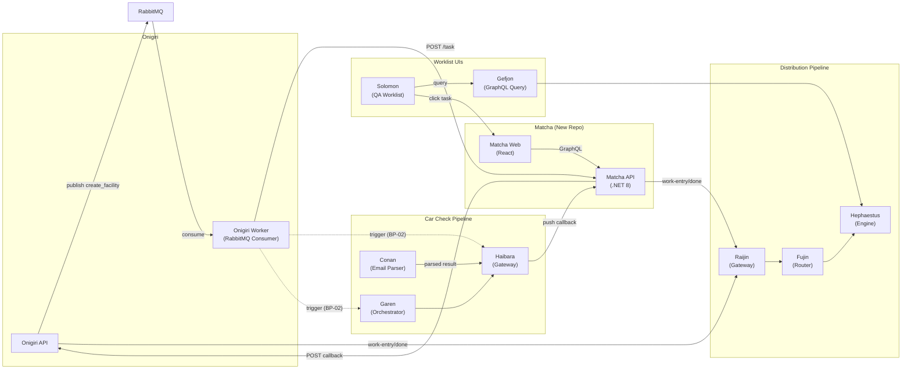
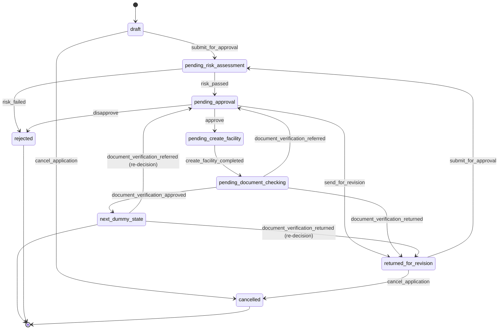
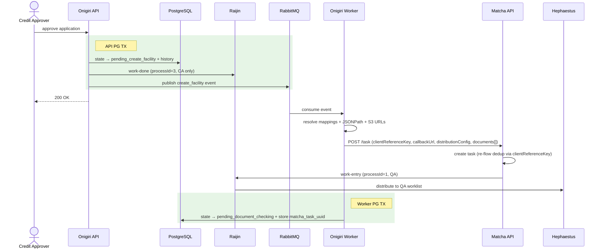
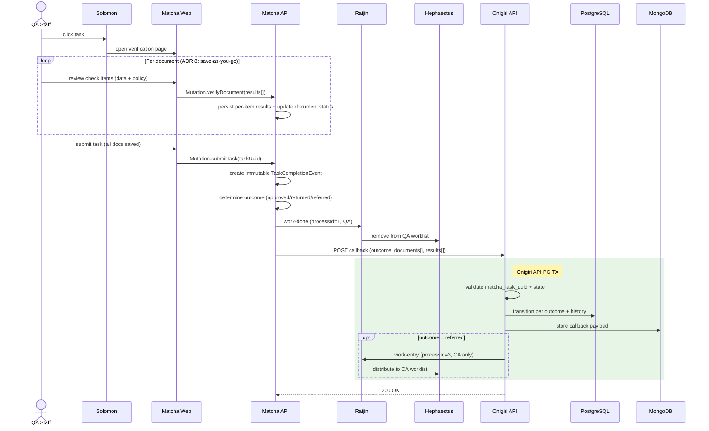
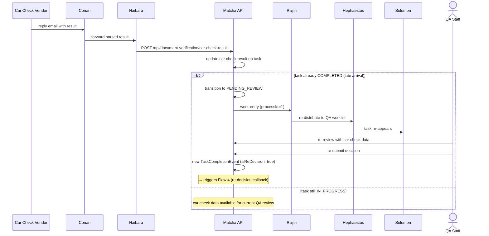
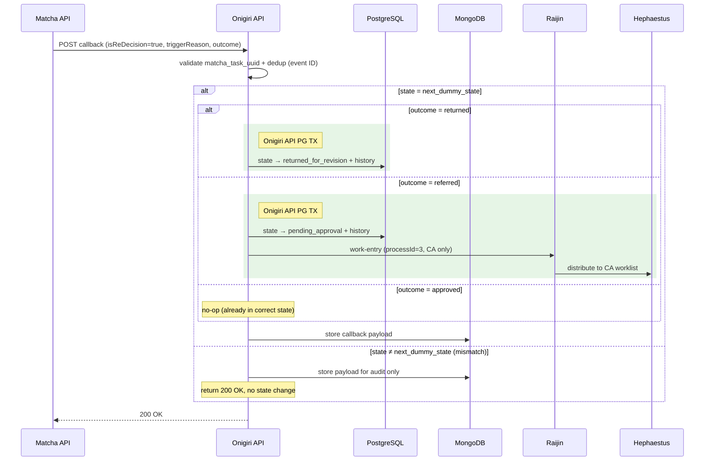
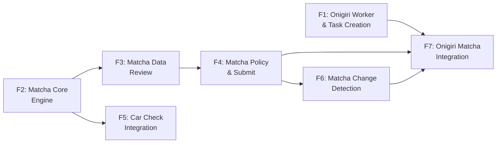

# Blueprint-03: Document Verification — Architecture

> **Project:** Onigiri (LOS — Loan Origination System 2.0) + Matcha (Document Verification Service)
> **Status:** Draft
> **Last Updated:** 2026-02-18
> **Prerequisites:** [Blueprint-02 (Credit Approval)](../02-Credit_Approval/Architecture-02-Credit-Approval.md)
> **BA Reference:** [Product Capabilities](./Product%20Capabilities.md)

---

## Executive Summary

**What it delivers:** Document verification after credit approval, introducing **Matcha** — a new standalone, domain-agnostic document verification service (separate repo, .NET 8 + React) designed for reuse across loans, insurance, and KYC (Know Your Customer).

**Key architecture choices:**
- **Matcha as a separate repo** — domain-agnostic engine with its own 4-state task lifecycle (PENDING → IN_PROGRESS → COMPLETED, with PENDING_REVIEW re-entry). Reusable by any client system.
- **RabbitMQ + Worker pattern** (consistent with BP-02 — Blueprint-02) — Onigiri Worker creates Matcha tasks after credit approval; decouples the approve action from S3 (Amazon Simple Storage Service) URL generation and external calls.
- **Ownership boundary** — Matcha owns QA task lifecycle + QA distribution via Solomon (processId=1); Onigiri retains CA distribution only (processId=3).
- **Outcome as data, not state** — immutable `TaskCompletionEvent` records each decision. Three outcomes: approved, returned, referred. PENDING_REVIEW re-entry only for car check late arrival (after task COMPLETED).
- **Async car check with bypass** — QA can submit without waiting for Haibara car check results; late data triggers PENDING_REVIEW and re-decision callback to Onigiri.
- **SHA-256 change detection** — `context_hash` (input data) vs `decision_hash` (QA decisions). On re-flow: unchanged documents (file + data) keep previous QA decisions; changed documents require new QA decisions. Also enables mid-review alerts if data changes while QA is reviewing.

**Scale:** 2 new Onigiri states, 6 new transitions, 4 cross-system flows, 3 API contracts, 6 Matcha entities, 7 delivery features (F1-F7) across two parallel tracks (Onigiri + Matcha).

**Not included:** Disbursement and post-verification downstream flows (→ future phase). `next_dummy_state` is a placeholder for the post-verification step.

---

## S1. Overview

This phase implements document verification after credit approval, introducing Matcha — a new standalone, domain-agnostic document verification service in a separate repo. Onigiri adds two new workflow states (`pending_document_checking` where Matcha handles QA — Quality Assurance verification, and `next_dummy_state` as a post-verification placeholder) and modifies `pending_create_facility` from terminal to a Worker-processed transition. A callback endpoint receives Matcha outcomes. Scope boundary: Matcha owns the QA task lifecycle and QA distribution via Solomon — Onigiri only handles CA (Credit Analyst) distribution (processId=3). Builds on Blueprint-02's `pending_create_facility` terminal state as the handoff point.

---

## S2. System Context



### Integration Table

| System | Role | Integration | Contact Point | BP-03 Change? |
|--------|------|-------------|---------------|:-------------:|
| **Matcha API** (new) | Document verification lifecycle, QA backend | REST (Representational State Transfer) | Worker → `POST /api/document-verification/task`; Matcha → `POST /api/credit-application/verification-callback` | New |
| **Matcha Web** (new) | QA verification UI (User Interface, three-panel layout) | URL link from Solomon | `{matchaWebUrl}/task/{taskUuid}` | New |
| **Raijin** | Distribution gateway — write-path entry point | REST | Onigiri/Matcha → Raijin (`POST` work-entry/work-done). Endpoint TBD — confirm with Distribution team. | **Config**: register Matcha client + processId=1 |
| **Fujin** | Distribution router (internal) | Internal (Raijin → Fujin → Hephaestus) | No client-side contact — infrastructure-level | **Config**: processId=1 routing |
| **Hephaestus** | Distribution engine — QA (processId=1) + CA (processId=3) | SQS (Amazon Simple Queue Service) via Raijin pipeline | `distribute-event-queue` | **Config**: processId=1 process, QA topic, Matcha URL |
| **Artemis** | Manual distribution ops (return/claim) | REST (Freyr/Solomon → Artemis) | Existing pattern, no Onigiri code | **Verify**: processId=1 for QA manual ops |
| **Solomon** | QA worklist UI | Receives tasks from Hephaestus, queries via Gefjon | Task link → Matcha Web URL | **Config**: processId=1 display, Matcha URL |
| **Gefjon** | Worklist query layer | GraphQL `getWorklistDistribute` (Solomon/Freyr → Hephaestus) | Existing query; may need processId=1 filter | **Verify**: processId=1 support |
| **Haibara** | Car check gateway (trigger + result relay) | REST | Trigger (BP-02): `POST /api/auto-check/send-email-v2`; Result: Haibara → Matcha `POST /api/document-verification/car-check-result` | **Yes** — add `MatchaApiUrl` config (F5) |
| **Garen** | Car check orchestrator (BP-02 trigger path) | REST | Alternative trigger path: Worker → Garen → Haibara. Endpoint TBD. | No — BP-02 scope |
| **Conan** | Email result parser (car check result path) | Email inbox → Haibara internal | Vendor reply email → Conan → Haibara | No — existing behavior |
| **RabbitMQ** | Unchanged from BP-02. API-to-Worker messaging. | AMQP (Advanced Message Queuing Protocol) | `create_facility` event | No |

> **Distribution pipeline note:** The main architecture flows show a simplified `SQS → Hephaestus` path. The full production write path is: Client → **Raijin** (gateway) → Artemis → **Fujin** (router) → **Hephaestus** (engine). Onigiri/Matcha interact with Raijin as the entry point. The read path is: Solomon/Freyr → **Gefjon** (GraphQL) → Hephaestus.

---

## S3. Domain Model

### Matcha Entities (New Repo)

```
VerificationTask 1──* VerificationTaskDocument 1──* VerificationTaskDocumentResult
       │                        │
       │                        * FK (Foreign Key) documentTypeKey
       * has many               │
       │                  DocumentType 1──* DocumentVerificationItem
TaskCompletionEvent
```

| Entity | Purpose |
|--------|---------|
| **VerificationTask** | Runtime: 4-state lifecycle (PENDING → IN_PROGRESS → COMPLETED ⟲ PENDING_REVIEW). PENDING_REVIEW only on car check late arrival after COMPLETED. Has many documents, has many TaskCompletionEvent. |
| **VerificationTaskDocument** | Runtime: one document within a task with SHA-256 (Secure Hash Algorithm) hash-based change detection. Has many results. |
| **VerificationTaskDocumentResult** | Runtime: per-item correct/incorrect + remark. |
| **TaskCompletionEvent** | Immutable audit: created on each COMPLETED entry. Re-decisions create new events (`isReDecision=true`). |
| **DocumentType** | Config: document types (35 seeded). Has many DocumentVerificationItem. |
| **DocumentVerificationItem** | Config: per-type check items (data items for field matching, policy items for boolean gates). |

### Onigiri Entities (New/Modified)

```
application (modified) ──── adds matcha_task_uuid
       │
document_verification_mapping (new) ──── maps upload boxes → Matcha document type keys

DraftApplicationDocument (MongoDB, modified) ──── adds documentVerificationRejections, matchaCallbackPayload
```

| Entity | Purpose |
|--------|---------|
| **document_verification_mapping** (new) | Config: maps upload boxes to Matcha document type keys + JSONPath data extraction config. |
| **application** (modified) | Adds `matcha_task_uuid` for cross-system tracing. |
| **DraftApplicationDocument** (MongoDB, modified) | Adds `documentVerificationRejections` and `matchaCallbackPayload` fields. |

---

## S4. Workflow / State Machine

### New States

| State | Thai Name | Description | Actor |
|-------|-----------|-------------|-------|
| `pending_document_checking` | รอตรวจเอกสาร | Matcha task created, QA verifying documents | QA (via Matcha) |
| `next_dummy_state` | (placeholder) | Post-verification step; placeholder for future phase | System |

### Modified States

| State | Change from BP-02 |
|-------|-------------------|
| `pending_create_facility` | Was terminal in BP-02. Now transitions to `pending_document_checking` via Worker. |

### New Actions

| Action | Triggered By |
|--------|-------------|
| `create_facility_completed` | Worker (system, after Matcha task creation) |
| `document_verification_approved` | Matcha callback (system) |
| `document_verification_returned` | Matcha callback (system) |
| `document_verification_referred` | Matcha callback (system) |

### Transition Table (extends BP-02 rows 1-9)

| ID | From State | Action | To State | Check Limit |
|----|-----------|--------|----------|:-----------:|
| 10 | `pending_create_facility` | `create_facility_completed` | `pending_document_checking` | No |
| 11 | `pending_document_checking` | `document_verification_approved` | `next_dummy_state` | No |
| 12 | `pending_document_checking` | `document_verification_returned` | `returned_for_revision` | No |
| 13 | `pending_document_checking` | `document_verification_referred` | `pending_approval` | No |
| 14 | `next_dummy_state` | `document_verification_returned` | `returned_for_revision` | No |
| 15 | `next_dummy_state` | `document_verification_referred` | `pending_approval` | No |

> Rows 13 & 15 (`referred`) publish credit approver `work-entry` (processId=3, CA role only). Rows 14-15 handle re-decision from Matcha's PENDING_REVIEW — only `next_dummy_state` has these transitions; other states = no-op.
>
> **Worklist distribution note:** SQS work-entry/work-done applies only to **CA and QA** roles. If the application's credit approver is a Sale team role (CO — Credit Officer, or AM — Area Manager, determined by risk level), there is no worklist distribution — Sale team manages work outside Hephaestus.

### State Diagram (Full Lifecycle — BP-02 + BP-03)



### Execution Patterns

- **Worker-Initiated (row 10):** API publishes `create_facility` to RabbitMQ on approve. Worker consumes, calls Matcha POST /task, then updates state to `pending_document_checking` in a separate PG (PostgreSQL) transaction.
- **Callback-Initiated (rows 11-15):** Matcha POSTs callback with outcome. Onigiri API validates state, transitions per outcome in a single PG transaction. For `referred`: publishes credit approver `work-entry` via Raijin (CA role only, same transaction).
- **Re-Decision (rows 14-15):** Same callback flow with `isReDecision=true`. Only `next_dummy_state` has these transitions — other states return 200 OK with no state change (audit only in MongoDB).

---

## S5. Key Flows

### Flow 1: Create Facility and Matcha Task Creation

**Trigger:** Credit approver clicks "Approve" (BP-02 row 5)
**Systems:** Onigiri API → RabbitMQ → Onigiri Worker → Matcha API → Raijin → Hephaestus



1. API transitions state to `pending_create_facility`, publishes credit approver `work-done` via Raijin (processId=3, CA role only), commits PG TX (transaction), then publishes `create_facility` event to RabbitMQ
2. Worker consumes event, resolves document mappings + JSONPath data extraction + S3 presigned URLs
3. Worker calls **Matcha POST /task** with `clientReferenceKey`, `callbackUrl`, `distributionConfig`, `carCheckConfig`, `documents[]`
4. Matcha creates task (detects re-flow via clientReferenceKey — unchanged documents keep previous QA decisions; changed documents require new QA decisions), publishes **work-entry** via Raijin (processId=1, QA distribution)
5. Worker transitions state to `pending_document_checking`, stores `matcha_task_uuid`, commits PG TX

**Transaction boundaries:** Step 1 = API PG TX (state + Raijin + RabbitMQ). Steps 2-5 = Worker PG TX (step 5 only; steps 2-4 outside TX).
**Failure:** Matcha call fails → Worker retries via RabbitMQ redelivery. Worker PG commit fails → orphan Matcha task, idempotent on retry (clientReferenceKey dedup).

> **Car check note:** Car check is initiated when the application enters `pending_approval` (BP-02 scope, Worker → Haibara/Garen → Vendor). By the time Matcha receives `carCheckConfig`, the car check is already in progress. Matcha only receives results via Haibara push callback (Flow 3). QA can bypass car check and submit without waiting — late results trigger PENDING_REVIEW (Flow 3 step 5).

### Flow 2: QA Verification and Callback

**Trigger:** QA opens task from Solomon worklist
**Systems:** Solomon → Matcha Web → Matcha API → Raijin → Hephaestus → Onigiri API



1. QA opens task from Solomon → Matcha verification page
2. **Per-document save (ADR 8):** QA reviews each document's check items — data items (correct/incorrect field matching) and policy items (mandatory boolean gates). Each document is saved individually via `Mutation.verifyDocument`, persisting per-item results. Progress survives browser close.
3. QA submits → Matcha creates immutable **TaskCompletionEvent**, determines outcome (`approved`/`returned`/`referred`), publishes `work-done` via Raijin (processId=1, QA distribution)
4. Matcha POSTs callback to Onigiri `callbackUrl` with outcome payload
5. Onigiri validates (`matcha_task_uuid` match, state = `pending_document_checking`), transitions per outcome, stores payload in MongoDB
6. For **referred** outcome: Onigiri publishes credit approver `work-entry` via Raijin (processId=3, CA role only)

**Transaction boundaries:** Steps 5-6 = single Onigiri API PG TX. Steps 1-4 = Matcha's responsibility. Each per-document save (step 2) is an independent Matcha PG TX.
**Failure:** Matcha retries callback 3x (1s, 2s, 4s exponential backoff). After max retries: `callback_status` = failed, requires manual retry.

### Flow 3: Car Check Result Delivery

**Trigger:** Vendor completes car check inspection
**Systems:** Vendor → Conan → Haibara → Matcha API → Raijin → Hephaestus

> Car check is initiated when the application enters `pending_approval` (BP-02 scope, Worker → Haibara/Garen → Vendor). This flow covers the **result delivery** path only.



1. Vendor replies with car check result → Conan parses email → forwards to Haibara
2. Haibara pushes result to Matcha `POST /api/document-verification/car-check-result` **(requires F5: `MatchaApiUrl` config in Haibara)**
3. Matcha stores car check result on the task
4. **If task still IN_PROGRESS:** car check data is available for QA's current review — no state change
5. **If task already COMPLETED (late arrival):** Matcha transitions to **PENDING_REVIEW**, publishes `work-entry` via Raijin (processId=1, task re-appears in Solomon)
6. QA re-reviews with car check data, re-submits → new TaskCompletionEvent (`isReDecision=true`), triggers Flow 4

**Transaction boundaries:** Steps 1-5 within Matcha's domain. Step 6 triggers Flow 4 (Onigiri callback).
**Failure:** Haibara push fails → retries. QA can bypass car check and submit without it (Flow 2) — late data triggers PENDING_REVIEW when it arrives.

### Flow 4: Re-Decision Callback (from PENDING_REVIEW)

**Trigger:** Matcha sends re-decision callback after QA re-review
**Systems:** Matcha API → Onigiri API → Raijin → Hephaestus



1. Matcha POSTs re-decision callback (`isReDecision=true`, `triggerReason`: `car_check_review`) to same `callbackUrl`
2. Onigiri checks state — **only `next_dummy_state` has re-decision transitions**:
   - `returned` → `returned_for_revision`
   - `referred` → `pending_approval` (+ credit approver `work-entry` via Raijin, processId=3, CA role only)
   - `approved` → no-op (already in correct state)
3. **State mismatch** (e.g., already `returned_for_revision`): returns 200 OK, stores payload in MongoDB for audit only

**Transaction boundaries:** Step 2 = Onigiri API PG TX (state transition + Raijin if referred). Step 3 = MongoDB write only.
**Idempotency:** Dedup via `matcha_task_uuid` + completion event ID. No reverse-and-reapply logic needed.

---

## S6. API Contracts

### Matcha: Create Task (Onigiri Worker → Matcha)

| Field | Value |
|-------|-------|
| **Endpoint** | `POST /api/document-verification/task` |
| **Purpose** | Create a document verification task for QA review |
| **Direction** | Onigiri Worker → Matcha API |
| **Auth** | Service-to-service (internal) |

**Key request fields:**

| Field | Type | Description |
|-------|------|-------------|
| `clientReferenceKey` | string | Client reference key (contract number); used for re-flow dedup |
| `callbackUrl` | string | Webhook URL for outcome notification |
| `clientId` | string | Client system identifier (`"onigiri"`) |
| `distributionConfig` | object | Opaque JSONB (JSON Binary) passed through to Raijin/Hephaestus for distribution |
| `carCheckConfig.applicationId` | string | Haibara reference for receiving car check results (car check already initiated in BP-02) |
| `documents[].documentTypeKey` | string | Matches Matcha's `document_type.key` |
| `documents[].data` | object | Key-value pairs for data-item verification |
| `documents[].fileUrls` | string[] | S3 presigned URLs for document images |

**Key response fields (201):**

| Field | Type | Description |
|-------|------|-------------|
| `taskUuid` | string | Matcha task identifier (stored as `matcha_task_uuid` in Onigiri) |
| `version` | int | Task version (increments on re-flow) |
| `documents[].isChanged` | boolean | Whether document content changed from previous version |

**Error contract:** 400 for invalid payload, 409 for duplicate clientReferenceKey with same version, 5xx for service failure. Worker retries via RabbitMQ redelivery.

### Matcha: Outcome Callback (Matcha → Onigiri)

| Field | Value |
|-------|-------|
| **Endpoint** | `POST /api/credit-application/verification-callback` |
| **Purpose** | Notify Onigiri of QA verification outcome |
| **Direction** | Matcha API → Onigiri API |
| **Auth** | Validates `X-Matcha-Task-Uuid` header |

**Key request fields:**

| Field | Type | Description |
|-------|------|-------------|
| `taskUuid` | string | Matcha task identifier |
| `clientReferenceKey` | string | Client reference key |
| `outcome` | string | `approved` / `returned` / `referred` |
| `isReDecision` | boolean | `true` if from PENDING_REVIEW re-review |
| `triggerReason` | string | `initial_submit` / `car_check_review` |
| `documents[].status` | string | Per-document outcome |
| `documents[].results[]` | array | Per-item: `checkName`, `status`, `rejectionReason`, `remark` |

**Error contract:** 200 OK on success (including idempotent dedup). 400 for invalid payload. 404 if `matcha_task_uuid` not found. Matcha retries 3x with exponential backoff on 5xx.

### Haibara: Car Check Result (Haibara → Matcha)

| Field | Value |
|-------|-------|
| **Endpoint** | `POST /api/document-verification/car-check-result` |
| **Purpose** | Push car check result to Matcha for QA review |
| **Direction** | Haibara → Matcha API |
| **Auth** | Service-to-service (internal) |
| **Dependency** | Requires F5: add `MatchaApiUrl` config in Haibara's `TriggerCheckAutoResultBusinessFlow` |

**Error contract:** Haibara retries on 5xx. Matcha task created without car check on initial failure — QA can bypass. Backward-compatible: existing Onigiri flow unaffected.

### Distribution: Work-Entry / Work-Done (Onigiri/Matcha → Raijin)

| Field | Value |
|-------|-------|
| **Purpose** | Distribute tasks and mark completion via Raijin → Fujin → Hephaestus pipeline |
| **Direction** | Onigiri API/Worker or Matcha API → Raijin |
| **Contact Point** | REST endpoint TBD — confirm with Distribution team |
| **Condition** | CA distribution: processId=3 (Onigiri). QA distribution: processId=1 (Matcha). |

**Error contract:** Raijin publish failure → caller retries. Distribution pipeline (Raijin → Artemis → Fujin → Hephaestus) is infrastructure-managed.

> **Note:** Matcha internal GraphQL (`Query.task`, `Mutation.verifyDocument`, `Mutation.submitTask`) is within the Matcha repo and belongs in feature specs.

---

## S8. Architecture Decisions

| # | Decision | Rationale |
|---|----------|-----------|
| ADR (Architecture Decision Record) 1 | Matcha as separate repo | Domain-agnostic, reusable by any client system (loans, insurance, KYC) |
| 2 | RabbitMQ Worker triggers Matcha task creation | Same pattern as BP-02 risk assessment; decouples approve from S3 URL generation + Matcha call |
| 3 | Matcha owns QA distribution (processId=1) | Co-locates distribution with task lifecycle; Onigiri only handles CA distribution (processId=3) |
| 4 | Outcome as data on immutable TaskCompletionEvent | 4-state lifecycle stays reusable. PENDING_REVIEW re-entry only for car check late arrival after COMPLETED |
| 5 | Car check bypass allowed, re-review later | Unblocks QA workflow; late data triggers PENDING_REVIEW |
| 6 | Haibara pushes car check results directly to Matcha | Simplest change: add `MatchaApiUrl` in Haibara. No Onigiri middleman |
| 7 | SHA-256 hash-based change detection | `context_hash` vs `decision_hash`. On re-flow: unchanged docs keep previous QA decisions, changed docs require new decisions. Also enables mid-review alerts |
| 8 | Per-document save-as-you-go | Tasks may have 10+ documents; progress must survive browser close. Submit is a separate final action |

---

## S9. Architectural Constraints

| Constraint | Requirement | Rationale |
|------------|------------|-----------|
| Audit retention | TaskCompletionEvent: immutable, never deleted | Compliance and traceability |
| Idempotency | All callbacks and distribution messages must be safe to retry | Distributed system reliability |
| Availability | Worker downtime = delayed, not lost (RabbitMQ persistence) | No data loss guarantee |

> Feature specs own latency targets, error handling details, and observability instrumentation.

---

## S11. Feature Decomposition

### F1: Onigiri Worker & Task Creation

**Scope:** Add RabbitMQ publish to approve TX, Worker consumer, `document_verification_mapping` table, `distributionConfig` builder, transition `pending_create_facility` → `pending_document_checking` (row 10)
**Constraints:** Must use BP-02 Pattern B (API TX → RabbitMQ → Worker TX). Mapping table drives JSONPath extraction. Must store `matcha_task_uuid` on application. Must pass `distributionConfig`.
**Delegated:** Internal retry strategy; error logging format; Mapping UI; JSONPath expression design

**Acceptance Criteria:**
- Approve action publishes `create_facility` event to RabbitMQ within API PG TX
- `document_verification_mapping` table seeded with upload box → Matcha document type key mappings
- JSONPath extraction produces correct `data` key-value pairs per document type
- `distributionConfig` builder produces valid opaque JSONB for Raijin/Hephaestus
- `matcha_task_uuid` column added to `application` table
- Worker consumes event, resolves mappings + JSONPath + S3 presigned URLs
- Worker calls Matcha POST /task with correct payload (clientReferenceKey, callbackUrl, distributionConfig, carCheckConfig, documents[])
- Worker transitions state to `pending_document_checking` and stores `matcha_task_uuid`

**Definition of Done:** Approve publishes event; Worker resolves mappings, creates Matcha task, transitions to `pending_document_checking`; Matcha task visible in Solomon QA worklist.

---

### F2: Matcha Core Engine

**Scope:** Repo setup, config tables + seed, POST /task, Raijin work-entry, three-panel UI, GraphQL query
**Constraints:** Must use 4-state lifecycle. Must store `distributionConfig` as opaque JSONB. clientReferenceKey dedup for re-flow. Distribute via Raijin (processId=1).
**Delegated:** UI layout; component structure; query optimization

**Acceptance Criteria:**
- Matcha repo bootstrapped (.NET 8 API + React Web)
- `DocumentType` and `DocumentVerificationItem` config tables seeded (35 document types)
- POST /task creates `VerificationTask` in PENDING state, transitions to IN_PROGRESS on distribution
- Re-flow via same clientReferenceKey creates new task version (not duplicate)
- Raijin `work-entry` published (processId=1); task appears in Solomon QA worklist
- Three-panel UI renders: document list, document viewer, checklist panel
- GraphQL `Query.task` returns task with documents and check items

**Definition of Done:** End-to-end from POST /task → QA sees task in Solomon → opens three-panel verification page with documents and check items loaded.

---

### F3: Matcha Data Review

**Scope:** `verifyDocument` mutation, floating checklist (data + policy items), per-document actions
**Constraints:** Data items = field matching (correct/incorrect). Policy items = boolean gates (mandatory).
**Delegated:** Checklist UX; validation messages

**Acceptance Criteria:**
- `Mutation.verifyDocument` persists per-item results (correct/incorrect + remark for data items, pass/fail for policy items)
- Each document save is independent — progress survives browser close (ADR 8)
- Policy items block document completion if any fail
- Data items show expected value vs document value for field matching

**Definition of Done:** QA can review and save each document individually; saved results persist across sessions; policy item gates enforce mandatory checks.

---

### F4: Matcha Policy & Submit

**Scope:** `submitTask` mutation, TaskCompletionEvent, Raijin work-done, webhook callback, 3 outcomes
**Constraints:** Must create immutable TaskCompletionEvent. Must be idempotent on callback.
**Delegated:** Submission confirmation UX; outcome display

**Acceptance Criteria:**
- `Mutation.submitTask` creates immutable `TaskCompletionEvent` with outcome (approved/returned/referred)
- Outcome determined from per-document results (priority: returned > referred > approved): any doc returned → task returned; else any doc referred → task referred; else all approved → task approved
- Raijin `work-done` published (processId=1) on submit
- Callback POST to `callbackUrl` with outcome payload (documents[], results[])
- Callback retries 3x (1s, 2s, 4s exponential backoff) on 5xx; `callback_status` tracks success/failure
- Duplicate submit returns idempotent response

**Definition of Done:** QA submits → TaskCompletionEvent created → task removed from Solomon → Onigiri receives callback with correct outcome and per-document results.

---

### F5: Car Check Integration

**Scope:** Receive car check result from Haibara push callback, bypass support (submit without car check), late data PENDING_REVIEW. Includes Haibara-side change: add `MatchaApiUrl` config in `TriggerCheckAutoResultBusinessFlow`.
**Constraints:** Car check bypass must be allowed. Late data → PENDING_REVIEW. Haibara change must be backward-compatible (existing Onigiri flow unaffected). Garen/Conan unchanged.
**Delegated:** Bypass UX; status indicators; Haibara config deployment strategy

**Acceptance Criteria:**
- `MatchaApiUrl` config added to Haibara's `TriggerCheckAutoResultBusinessFlow`
- Haibara pushes car check results to Matcha POST endpoint
- Existing Onigiri car check flow unaffected (backward-compatible)
- POST /api/document-verification/car-check-result stores car check result on task
- If task IN_PROGRESS: car check data available in QA's current review session
- If task COMPLETED (late arrival): task transitions to PENDING_REVIEW, Raijin `work-entry` published (processId=1), task re-appears in Solomon
- QA can submit without car check data (bypass); car check status shown as indicator
- Re-review after PENDING_REVIEW creates new TaskCompletionEvent (`isReDecision=true`)

**Definition of Done:** Haibara pushes car check results to Matcha (backward-compatible). Car check data displayed in QA review. Late arrival triggers PENDING_REVIEW → QA re-reviews → re-decision callback sent to Onigiri.

---

### F6: Matcha Change Detection

**Scope:** Hash generation, re-flow decision copying (unchanged docs keep previous QA decisions, changed docs require new decisions), mid-review alerts
**Constraints:** Must use SHA-256 `context_hash` + `decision_hash`.
**Delegated:** Hash scope; change alert UX

**Acceptance Criteria:**
- SHA-256 `context_hash` generated from document file + data on task creation
- `decision_hash` generated from QA's per-item results on document save
- Re-flow with same clientReferenceKey: unchanged documents (same `context_hash`) automatically keep previous QA decisions
- Re-flow with changed documents (different `context_hash`): previous decisions cleared, QA must make new decisions
- Mid-review alert shown if `context_hash` changes while QA is reviewing (data updated externally)

**Definition of Done:** Re-flow correctly copies decisions for unchanged docs and clears decisions for changed docs. Mid-review alert fires when data changes during active review.

---

### F7: Onigiri Matcha Integration

**Scope:** Callback endpoint, 3 outcome transitions, re-decision handling, worklist state display, rejection reason display
**Constraints:** Must handle all 3 outcomes + re-decision. Must be idempotent (dedup via task UUID + event ID). Must display new states in worklist. Must show Matcha rejection reasons on revision.
**Delegated:** MongoDB storage structure; state badge styling; reason display format

**Acceptance Criteria:**
- Callback endpoint validates `matcha_task_uuid` match + current state
- `approved` → `next_dummy_state`; `returned` → `returned_for_revision`; `referred` → `pending_approval` + Raijin `work-entry` (processId=3, CA only)
- Re-decision (`isReDecision=true`): only `next_dummy_state` transitions; other states → 200 OK, audit in MongoDB
- Duplicate callback (same event ID) returns idempotent 200 OK
- Callback payload stored in MongoDB `DraftApplicationDocument.matchaCallbackPayload`
- Rejection reasons extracted into `documentVerificationRejections`
- `pending_document_checking` and `next_dummy_state` displayed in worklist with correct Thai names
- Returned applications show Matcha per-document rejection reasons
- Solomon task link navigates to Matcha Web verification page

**Definition of Done:** All 3 outcomes transition correctly; re-decision handled; callbacks idempotent; Sale sees new states in worklist; returned applications display rejection reasons from Matcha.

---

## S12. Development Phases



### Two Parallel Tracks

**Onigiri Track** (depends on BP-02 infrastructure):

| Phase | Feature | Key Dependencies |
|-------|---------|-----------------|
| 1 | F1: Onigiri Worker & Task Creation | BP-02 RabbitMQ + Worker infrastructure |
| 2 | F7: Onigiri Matcha Integration | F1 (state machine) + F4 (Matcha callback ready) |

**Matcha Track** (independent repo, can start in parallel):

| Phase | Feature | Key Dependencies |
|-------|---------|-----------------|
| 1 | F2: Matcha Core Engine | Distribution pipeline config (Raijin/Hephaestus processId=1) |
| 2 | F3: Matcha Data Review | F2 (core engine and UI framework) |
| 3 | F4: Matcha Policy & Submit | F3 (verification results exist to determine outcome) |
| 4 | F5: Car Check Integration | F2 (core engine) + Haibara config deployed |
| 5 | F6: Matcha Change Detection | F4 (submit and completion events exist) |

**Cross-track dependency:** F7 (Onigiri integration) requires F4 (Matcha callback) to be functional. F2 (Matcha core) requires external distribution pipeline config from Distribution team.
