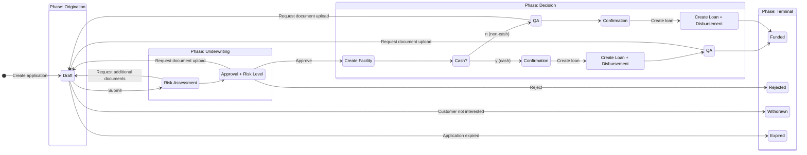

# ATLAS — Product Capabilities & Strategic Blueprint

**Role**: `@ARCHITECT`
**Purpose**: This document defines the **Capabilities ("What")** of the Onigiri Service — the All-in-One Loan Origination System (LOS) for end-to-end underwriting.

> **Onigiri (おにぎり)** — A tightly packed, self-contained unit. Like the rice ball, Onigiri wraps the entire loan origination lifecycle into a single, cohesive product — from application intake through underwriting to disbursement. Everything the borrower needs, held together in one place.
>
> **Scope**: Onigiri is a **monorepo loan origination platform**. It owns the loan application lifecycle, the underwriting workflow, and the risk assessment engine. It does **not** own document verification (Matcha), customer master data (DaVinci), or branch task orchestration (Sensei). It integrates with these services at well-defined boundaries.

---

## 1. Core Capability: Smart Form (Application Intake)

**Goal**: Provide a configurable, section-based application form that captures borrower, guarantor, loan, and collateral information — storing all data as a flexible JSON object to support rapid product evolution without schema migrations.

### Why It Exists (First Principles)

*   **Product Variety Problem**: The company offers multiple loan products (car title, land title, personal). Each product requires different fields, sections, and validation rules. A rigid, column-per-field relational model cannot keep up with product launches and changes.
*   **Branch UX**: Collection officers and branch staff fill applications in the field — sometimes at the customer's home, sometimes at the branch. The form must be steppable, savable mid-way, and resumable.
*   **Data Flexibility**: Loan products evolve. New fields, new sections, new conditional logic. Storing application data as a JSON document in DocumentDB means the form schema can evolve without database migrations for every field change.

### Compositional Structure

The Smart Form follows a strict **Page → Section → Field** hierarchy:

```
  ┌───────────────────────────────────────────┐
  │   Application Form                        │
  ├───────────────────────────────────────────┤
  │                                           │
  │   📄 Page 1: Borrower Information         │
  │   ┌─────────────────────────────────────┐ │
  │   │ Section: Customer Full Profile      │ │
  │   │   first_name, last_name, birthdate  │ │
  │   │   id_card, ...                      │ │
  │   ├─────────────────────────────────────┤ │
  │   │ Section: Address (ID Card)          │ │
  │   │   Full address from ID card         │ │
  │   ├─────────────────────────────────────┤ │
  │   │ Section: Address (Document)         │ │
  │   │   Short address for correspondence  │ │
  │   ├─────────────────────────────────────┤ │
  │   │ Section: NCB Consent Initiation     │ │
  │   │   Consent + OTP verification        │ │
  │   ├─────────────────────────────────────┤ │
  │   │ [ + Add Section ]                   │ │
  │   └─────────────────────────────────────┘ │
  │                                           │
  │   📄 Page 2: Loan Setup                   │
  │   ┌─────────────────────────────────────┐ │
  │   │ Section: Customer Address (3)       │ │
  │   ├─────────────────────────────────────┤ │
  │   │ Section: Collateral — Car           │ │
  │   ├─────────────────────────────────────┤ │
  │   │ Section: Finance Option — Monthly   │ │
  │   ├─────────────────────────────────────┤ │
  │   │ Section: Finance Option — Bullet    │ │
  │   ├─────────────────────────────────────┤ │
  │   │ [ + Add Section ]                   │ │
  │   └─────────────────────────────────────┘ │
  │                                           │
  │   📄 Guarantor (permanent structure)      │
  │   📄 Summary (permanent structure)        │
  │   📄 Document Upload (permanent structure)│
  │                                           │
  └───────────────────────────────────────────┘
```

### Permanent vs. Configurable Pages

The form has a **fixed sequence of logical stages** with configurable content within each:

| Stage | Configurable? | Description |
|-------|--------------|-------------|
| **Borrower** | ✅ Sections can be added, split across pages, reordered | Captures applicant profile, addresses, NCB consent |
| **Guarantor** | 🔒 Structure is permanent; pages within are splittable | Guarantor identity, relationship to borrower |
| **Loan Setup** | ✅ Sections can be added, reordered | Collateral, finance options, terms |
| **Summary** | 🔒 Permanent | Review of all entered information before submission |
| **Document Upload** | 🔒 Permanent | Upload required supporting documents |

### Section Properties

Each section is a self-contained configuration unit with:

*   **Section ID**: Unique identifier (e.g., `customer_full_profile`, `address_full_address`)
*   **Field List**: Ordered set of fields with their types, labels, and validation rules
*   **Information Owner**: Which entity "owns" the data in this section (borrower, guarantor, collateral)
*   **Validation Rules**: Field-level and section-level validation
*   **External Integration**: Some sections trigger external actions (e.g., NCB consent → OTP flow)
*   **Logical Document Requirement**: Sections can declare document requirements based on their data
*   **Section Completion**: Tracks whether all required fields in the section are filled
*   **Customized Configurations**: Product-specific overrides per loan campaign

### Field Definition

Each field within a section carries:

| Property | Description |
|----------|-------------|
| `field_name` | Machine-readable key (e.g., `first_name`, `credit_line`) |
| `label` | Human-readable display name (Thai/English) |
| `required` | Whether the field is mandatory for form submission |
| `type` | Input type (text, number, date, select, etc.) |
| `validation` | Rules (regex, range, conditional) |

### Data Persistence Model

Application data and workflow state are stored in **separate databases**, each optimized for its purpose:

| Layer | Database | What It Stores | When It Writes |
|-------|----------|----------------|----------------|
| **Application Data** | **DocumentDB** | Full JSON application document (all form sections, field values, uploaded document references) | Every **save draft** action and every **workflow transition** |
| **Workflow State & Logs** | **RDS** | Current workflow state, state transition history, timestamps, actor IDs, audit trail | Every **workflow transition** |

*   **DocumentDB** is the source of truth for "what was captured." Each save (whether explicit save-draft or automatic on transition) writes the complete JSON document. This enables mid-session recovery, version history, and schema-free evolution.
*   **RDS** is the source of truth for "where is this application in the process." It stores the state machine position, transition logs, and audit metadata — but **not** the application data itself.
*   **Rationale**: DocumentDB handles the flexible, document-shaped application data naturally (no DDL changes for new fields). RDS handles the relational, query-heavy workflow state (which application is in which state, SLA tracking, reporting). Separating these concerns means each database does what it's best at.

---

## 2. Core Capability: Underwriting Workflow

**Goal**: Provide a state-machine-driven workflow that governs the lifecycle of a loan application from creation through to funding, with customizable execution steps within each state — without making the workflow topology itself customizable.

### Why It Exists (First Principles)

*   **Process Integrity**: Loan underwriting is a regulated process with mandatory steps (risk assessment, approval authority, QA). The workflow topology must enforce this sequence.
*   **Maintenance Cost**: Fully customizable workflow engines (arbitrary state transitions, user-defined states) are extremely hard to maintain, test, and audit. Bugs in workflow logic can cause loans to skip mandatory checks.
*   **Practical Flexibility**: What changes frequently is not *which states exist* but *what happens inside each state* — the execution steps, the checks, the integrations. By fixing the workflow topology and making execution steps configurable, we get the right trade-off between rigidity (for compliance) and flexibility (for operations).

### Workflow Phases & States

The workflow is organized into **four phases**, each containing one or more states:



### State Definitions

| State | Phase | Purpose | Key Actions |
|-------|-------|---------|-------------|
| **Draft** | Origination | Application data entry, document upload, and returns for edits. This is the single entry state — all data capture and document collection happens here. | CO fills smart form, uploads documents, Wasabi early-warning scan, submits when ready |
| **Risk Assessment** | Underwriting | Automated + manual risk scoring | Execute risk strategy engine, generate risk level, determine required docs |
| **Approval + Risk Level** | Underwriting | Authorization based on risk level and approval authority | Approver reviews, approves (→ Create Facility), rejects (→ Rejected), or requests documents (→ Draft) |
| **Create Facility** | Decision | Create facility accounts in core banking | System integration to create facility |
| **Cash?** | Decision | Routing decision based on disbursement type | System auto-routes: cash vs. non-cash path |
| **Confirmation** | Decision | Confirm loan details and disbursement terms | Variance confirmation (differs for cash vs. transfer) |
| **Create Loan + Disbursement** | Decision | Create loan account and release funds | System integration to create loan and disburse |
| **QA** | Decision | Quality assurance check | Verify completeness, check risk criteria, deviation documents, document printouts |
| **Funded** | Terminal | Loan successfully disbursed | End state — loan is active |
| **Rejected** | Terminal | Application rejected at approval | End state |
| **Withdrawn** | Terminal | Customer not interested / withdrew | End state |
| **Expired** | Terminal | Application exceeded time limit | End state — automatic, system-triggered |

### Cash vs. Non-Cash Loan Path

The workflow diverges at the **Create Facility** state via a **Cash?** routing decision:

```
                                       ┌─── y (Cash) ──→ Confirmation → Create Loan + Disbursement → QA → Funded
  Approval → Create Facility → Cash? ──┤
                                       └─── n (Non-cash) ──→ QA → Confirmation → Create Loan + Disbursement → Funded
```

*   **Cash loans**: Confirmation first (variance for cash), then create loan + disburse, then QA *after* disbursement (money has already left — post-disbursement verification).
*   **Non-cash loans**: QA first (pre-disbursement verification while transfer can be held), then confirmation, then create loan + disburse.

### Return & Pull-back Paths

Multiple states can return the application to Draft for corrections or additional documents:

| From | To | Trigger | Purpose |
|------|----|---------|---------|
| Risk Assessment | Draft | Request additional documents | Missing docs discovered during risk review |
| Approval | Draft | Request document upload | Approver needs more documentation |
| QA (cash path) | Draft | Request document upload | Post-disbursement doc issues |
| QA (non-cash path) | Draft | Request document upload | Pre-disbursement doc issues |
| Any active state | Draft | Return / Pull back | Supervisor recalls application |

### Customizable Execution Steps (Inside States)

While the workflow topology is **fixed**, the **execution steps inside each state** are configurable. Each state can have a set of pluggable steps that run when the application enters or exits that state:

*   **Document checks**: Verify required documents are present and valid
*   **Risk criteria checks**: Run specific risk policies
*   **Integration calls**: Trigger external services (NCB, core banking, Wasabi)
*   **Approval routing**: Determine which approval authority level is needed
*   **Printouts & reports**: Generate required documents

Example — execution steps within Draft:
1. Display smart form with section-based data entry
2. Display document upload interface
3. Run Wasabi early-warning scan on uploaded documents
4. Validate required documents against loan campaign requirements
5. On submit → transition to Risk Assessment

---

## 3. Core Capability: Loan Campaign Configuration

**Goal**: Define and manage loan product configurations (campaigns) that house **all configuration** for the loan a campaign will create — pricing, eligibility, application template, risk strategy, and workflow execution steps — without code changes.

### Why It Exists (First Principles)

*   **Product Launch Speed**: The business launches new loan products (campaigns) regularly — new car title products, seasonal promotions, segment-specific offers. Each needs distinct eligibility rules, pricing, risk strategies, and field requirements.
*   **Operational Independence**: Product managers and credit officers need to configure new campaigns without developer involvement.
*   **Single Source of Truth**: A single campaign configuration drives the **entire** application lifecycle — from which form fields appear, to which risk policies execute, to what execution steps run inside each workflow state. This prevents misalignment between intake, underwriting, and decision.

### Campaign Configuration Components

A loan campaign is the **single umbrella** that houses everything needed to originate a specific loan product:

```
  ┌─────────────────────────────────────────┐
  │          Loan Campaign                  │
  │          e.g., "Car Title Default 2026" │
  └──────────────────┬──────────────────────┘
                     │
    ┌────────┬───────┼────────┬──────────────┐
    │        │       │        │              │
    ▼        ▼       ▼        ▼              ▼
  ┌──────┐ ┌─────┐ ┌──────┐ ┌──────────┐ ┌──────────────┐
  │Pricing│ │Elig.│ │App   │ │Risk      │ │Workflow      │
  │       │ │     │ │Templ.│ │Strategy  │ │Execution     │
  │       │ │     │ │      │ │          │ │Steps         │
  └──────┘ └─────┘ └──────┘ └──────────┘ └──────────────┘
                      │
               ┌──────┼──────┐
               │      │      │
               ▼      ▼      ▼
            Fields  Pages  Required
                           Documents
```

| Dimension | What It Configures |
|-----------|-------------------|
| **Pricing** | Loan amount range, interest rate, available tenors, max LTV |
| **Eligibility Criteria** | Rule-based gateway (customer type, age, collateral, credit score) |
| **Application Template** | Which pages/sections/fields appear, required documents |
| **Risk Strategy** | Which risk assessment strategy to execute (Strategy → Policy → Rule) |
| **Workflow Execution Steps** | What pluggable steps run inside each workflow state (checks, integrations, validations) |

### Loan Pricing

Defines the financial parameters of the loan product:

| Parameter | Example Value |
|-----------|---------------|
| Loan amount range | 3,000 – 500,000 |
| Interest rate | 24% |
| Available tenors | 3, 6, 9, 12, ... months |
| Max LTV | 120% |
| Min/Max credit line | Configurable per campaign |

> **Business Intent**: Give the branch enough information to sell the loan — maximum possible loan size, available tenors, and rate. This is customer-facing information used during the sales conversation.

### Eligibility Criteria

Rule-based gateway that determines whether a customer qualifies for this loan campaign. Evaluated **before** full application entry:

| Criteria | Operator | Example Value |
|----------|----------|---------------|
| Customer type | `=` | "new" |
| Customer age | `>=` | 20 |
| Customer age | `<=` | 70 |
| Car brand | `like` | Toyota, Honda |
| Collateral type | `=` | "car" |
| Occupation group | `in` | Civil servant |
| B-score | `>` | 500 |

> **Business Intent**: Ensure the customer has a reasonable chance of getting the loan before investing time in a full application.

### Application Data & Document Requirements

Per-campaign configuration of:

*   **Which fields** appear in the smart form (field list with required/optional flags)
*   **Which documents** are required (with allow/require distinction)
*   **Conditional document logic**: Some documents become required based on risk assessment output (e.g., "Require proof of income if risk level ≥ 4")

---

## 4. Core Capability: Risk Assessment Engine

**Goal**: Execute a configurable risk assessment strategy that evaluates loan applications against policies and rules to produce a risk level, deviation flags, and conditional document requirements — with **zero code changes** for rule modifications.

### Why It Exists (First Principles)

*   **Market Volatility**: Subprime lending is highly susceptible to economic forces and special circumstances. Risk policies must change rapidly — sometimes weekly — in response to market conditions, regulatory changes, and portfolio performance.
*   **Operational Agility**: If every risk rule change requires a code deployment, the business cannot react fast enough. The rule engine must be fully configurable by risk officers.
*   **Auditability**: Every risk decision must be traceable back to which strategy, policy, and rule produced it. The evaluation chain must be logged and reproducible.

### Architecture: JMESPath-Based Rule Engine

The risk engine takes the **JSON application object** (stored in DocumentDB) as its sole input. Each rule uses a **JMESPath expression** to extract the relevant value from the application, then evaluates it against a fixed parameter using a comparison operator.

```
  ┌─────────────────────────┐
  │  JSON Application Object│    (from DocumentDB)
  │  {                      │
  │    borrower: {           │
  │      nationality_id: 1,  │
  │      age: 35,            │
  │      addresses: [...],   │
  │      occupation: {...}   │
  │    },                    │
  │    guarantors: [...],    │
  │    collateral: {...},    │
  │    loan: {...}           │
  │  }                       │
  └────────────┬────────────┘
               │
               ▼
  ┌─────────────────────────┐
  │  JMESPath Expression     │    e.g., "borrower.nationality_id"
  │  → Extract Value         │    → 1
  └────────────┬────────────┘
               │
               ▼
  ┌─────────────────────────┐
  │  Compare (Logic + Param) │    e.g., "= 1" (Thai)
  │  → Match / No Match      │
  └────────────┬────────────┘
               │
               ▼
  ┌─────────────────────────┐
  │  Resolution              │
  │  → Risk Level            │    e.g., 10
  │  → Route to next rule    │    (optional — chain evaluation)
  │  → Deviation flag        │    (optional)
  │  → Required documents    │    (optional)
  │  → Active / Inactive     │    (version control)
  └─────────────────────────┘
```

### Hierarchy: Strategy → Policy → Rule

```
  Strategy (e.g., "CarTitleDefault")
  │
  ├── Policy 1: สัญชาติของผู้กู้ (Applicant Nationality)
  │   ├── Rule 1.1: CustomerNationality = Thai         → Risk 10
  │   └── Rule 1.2: CustomerNationality ≠ Thai         → Risk 99 + Deviation ✓
  │
  ├── Policy 2: อายุผู้กู้ (Applicant Age)
  │   ├── Rule 2.1: CustomerStandardAgeYears < 20      → Risk 70
  │   ├── Rule 2.2: CustomerStandardAgeYears ∈ [20,70] → Risk 10
  │   └── Rule 2.3: CustomerStandardAgeYears > 70      → Risk 10
  │
  ├── Policy 3: พื้นที่ให้บริการ (Service Area)
  │   ├── Rule 3.1: CurrentAddressInServiceArea ≥ 1yr  → Risk 10
  │   ├── Rule 3.2: IDCardAddressInServiceArea ≥ 1yr   → Risk 10
  │   └── Rule 3.3: No qualifying address              → Route → Policy 4
  │
  ├── Policy 4: ที่ทำงาน (Workplace Service Area)
  │   ├── Rule 4.1: WorkplaceInServiceArea ≥ 1yr       → Risk 10
  │   └── Rule 4.2: WorkplaceNotInServiceArea          → Route → Policy 5
  │
  ├── Policy 5: ผู้ค้ำประกัน (Guarantor)
  │   ├── Rule 5.1: HasGuarantor = TRUE                → Route → [Policy 47–58] ✓
  │   └── Rule 5.2: HasGuarantor = FALSE               → Risk 99 + Deviation ✓
  │
  ├── Policy 6: เขตพื้นที่ (Operating Area)
  │   ├── Rule 6.1: AddressInOperatingArea = TRUE      → Risk 10
  │   └── Rule 6.2: AddressInNonOperatingArea          → Risk 99
  │
  ├── Policy 7: ประเภทอาชีพ (Occupation Type)
  │   ├── Rule 7.1: OccupationType ∈ {government,...}  → Risk 10 + Deviation ✓
  │   ├── Rule 7.2: OccupationType ∈ {informal,...}    → Risk 70
  │   ├── Rule 7.3: OccupationType ∈ {salaried,...}    → Risk 10
  │   └── Rule 7.4: OccupationType ∈ {restricted,...}  → Risk 10 + Deviation ✓
  │
  └── Policy 8: ประเภทธุรกิจ (Business Type)
      └── Rule 8.1: CustomerBusinessType               → ...
```

### Rule Definition Model

Each rule is a self-contained, configurable evaluation unit:

| Field | Description | Example |
|-------|-------------|---------|
| `policy_id` | Parent policy this rule belongs to | `1` |
| `rule_id` | Unique identifier within the policy | `1.1` |
| `rule_name` | Human-readable name | `CustomerNationality` |
| `jmespath_expr` | JMESPath expression to extract value from JSON application | `borrower.nationality_id` |
| `param` | The parameter category being evaluated | `CustomerNationality` |
| `logic` | Comparison operator | `=`, `!=`, `>=`, `<=`, `>`, `<`, `in`, `between`, `not_in` |
| `value` | The fixed comparison value(s) | `1` (Thai), `[20,70]`, `"Toyota,Honda"` |
| `risk_level` | Resulting risk level if this rule matches | `10`, `70`, `99` |
| `route` | Next rule/policy to evaluate (if chaining) | `policy_4.rule_4.1` or blank (terminal) |
| `extra_docs` | Additional documents required if this rule matches | `"proof_of_income"` or blank |
| `deviation` | Whether this result flags a deviation (requires higher approval) | `true` / `false` |
| `active` | Whether this rule is currently active | `true` / `false` |
| `version` | Rule version for audit trail | `1` |

### Evaluation Flow

When an application enters the **Risk Assessment** workflow state, the engine executes:

```
  ┌─────────────────┐
  │ Load Strategy    │  (determined by Loan Campaign config)
  │ for this app     │
  └────────┬────────┘
           │
           ▼
  ┌─────────────────┐
  │ For each Policy  │  (in order: Policy 1, 2, 3, ...)
  │ in the Strategy  │
  └────────┬────────┘
           │
           ▼
  ┌─────────────────────────────────┐
  │ For each Rule in this Policy    │  (in order: 1.1, 1.2, ...)
  │                                 │
  │ 1. Extract value via JMESPath   │
  │ 2. Compare value vs. param      │
  │ 3. If MATCH: ← FIRST MATCH WINS│
  │    a. Record risk_level         │
  │    b. Record deviation flag     │
  │    c. Record extra docs         │
  │    d. If route → jump to rule   │
  │    e. If no route → next policy │
  │    f. STOP evaluating this      │
  │       policy (no further rules) │
  │ 4. If NO MATCH:                 │
  │    → try next rule in policy    │
  └────────┬────────────────────────┘
           │
           ▼
  ┌─────────────────┐
  │ Aggregate Results│
  │ across all       │
  │ policies         │
  └────────┬────────┘
           │
           ▼
  ┌──────────────────────────────────┐
  │ Final Risk Assessment Output     │
  │ • max(risk_level) across policies│
  │ • union(deviation flags)         │
  │ • union(required documents)      │
  │ • full evaluation trace (log)    │
  └──────────────────────────────────┘
```

### Rule Chaining (Route)

Rules can **chain** to other rules or policies. This enables cascading evaluation without duplicating logic:

*   **Policy 3** (Service Area) → if no qualifying address, routes to **Policy 4** (Workplace)
*   **Policy 4** (Workplace) → if workplace not in area, routes to **Policy 5** (Guarantor)
*   **Policy 5** (Guarantor) → if guarantor provided, routes to **Policies 47–58** (guarantor-specific checks)

This creates a **decision tree** where each branch is a configurable rule, not hardcoded logic.

### Risk Level to Approval Authority Mapping

| Risk Level | Approver |
|------------|----------|
| 10 | CO / SCO / BM / SBM |
| 20 | AM (Area Manager) |
| 30 | CA (Credit Analyst) |
| 40 | CA Manager |
| 50 | CRO |
| 60 | CEO |
| 70 | — (auto-decline or special handling) |
| 99 | Auto-decline (policy violation) |

### Risk Assessment Outputs

The engine produces a composite result per application:

*   **Risk Level**: The **highest** risk level across all evaluated policies → determines approval authority
*   **Deviation Flags**: Per-policy flags indicating the application deviates from standard policy → escalates to higher approval authority than the risk level alone would require
*   **Required Documents**: Conditional document list triggered by specific rule matches (e.g., "Require applicant or guarantor proof of income if risk level ≥ 4")
*   **Evaluation Trace**: Complete log of which strategy/policy/rule was evaluated, what value was extracted, what comparison was made, and what the result was — for audit and debugging

### Why JMESPath (Design Rationale)

| Alternative | Why Not |
|-------------|---------|
| Hardcoded business logic | Cannot change without code deployment. Unacceptable for weekly-changing risk policies. |
| Custom DSL | High development and maintenance cost. Learning curve for risk officers. |
| SQL-based rules | Requires the application data to be in a relational schema — contradicts the JSON/DocumentDB data model. |
| **JMESPath** | ✅ Industry-standard JSON query language. Works directly on the JSON application object. Well-documented, well-tested, available in all major languages. Risk officers learn a small, well-defined expression syntax rather than a full programming language. |

---

## 5. Cross-Cutting Concern: External Integrations

Onigiri integrates with several platform services at defined boundaries:

| Service | Integration Point | Direction | Purpose |
|---------|-------------------|-----------|---------|
| **Matcha** (Document Verification) | After document upload | Onigiri → Matcha | Submit uploaded documents for verification |
| **Wasabi** (AI Document Verification) | During Draft (document upload) | Onigiri → Wasabi → Onigiri | Early-warning scan of uploaded documents before formal submission |
| **DaVinci** (Customer Master Data) | Application creation | Onigiri → DaVinci | Resolve customer identity, pull existing customer data |
| **Sensei** (Branch Worklist) | Various workflow states | Onigiri → Sensei | Push tasks when branch action is needed (e.g., "collect additional documents") |
| **Core Banking** | Create Facility + Loan state | Onigiri → Core Banking | Create facility and loan accounts |
| **NCB** (Credit Bureau) | Smart Form — NCB Consent section | Onigiri → NCB | Initiate credit bureau inquiry via OTP consent |

---

## Resolved Design Decisions (ADR Style)

| # | Decision | Context | Consequence |
|---|----------|---------|-------------|
| D1 | **JSON application data in DocumentDB, workflow state in RDS** | Loan products evolve rapidly; adding columns for every new field is unsustainable. Application data is document-shaped; workflow state is relational. | Application data is a flexible JSON document stored in DocumentDB on every save-draft and transition. RDS stores only workflow state and audit logs. Each database does what it's best at. Enables rapid product iteration without DDL changes. |
| D2 | **Fixed workflow topology, configurable execution steps** | Fully customizable workflow engines are hard to maintain, test, and audit. Workflow topology changes are rare; execution step changes are frequent. | The state machine (Draft → Risk Assessment → Approval → Create Facility → ... → Funded) is hardcoded. What happens *inside* each state is configurable. Reduces maintenance burden and testing surface. Reversibility: high — adding a new state requires code but is a bounded change. |
| D3 | **Cash vs. Non-Cash divergence after Create Facility** | Cash loans need post-disbursement QA (money has already left). Non-cash loans can afford pre-disbursement QA (transfer can be held). | Two paths through the Decision phase. Cash: Confirmation → Create Loan + Disburse → QA → Funded. Non-cash: QA → Confirmation → Create Loan + Disburse → Funded. Adds workflow complexity but matches real-world operational risk. |
| D8 | **Merged Draft + Document Upload into single Draft state** | Document upload is fundamentally part of application preparation, not a separate workflow stage. Separating them added unnecessary state transitions and UX friction. | Single Draft state handles all data entry and document collection. Simpler state machine with fewer return paths. All "request document" returns go to Draft. Trade-off: Draft becomes a larger, more complex state internally — mitigated by configurable execution steps within it. |
| D4 | **Page → Section → Field composability** | Different loan products need different form layouts. A monolithic form per product doesn't scale. | Sections are reusable building blocks. Pages are orderable containers of sections. New products compose existing sections with optional new ones. Reduces duplication. |
| D5 | **Campaign as single configuration umbrella** | Each loan product has unique eligibility, pricing, fields, documents, risk strategy, and workflow execution steps. Scattering these across multiple configuration points causes misalignment. | A single campaign configuration houses ALL loan-related config: pricing, eligibility, application template, risk strategy, and workflow execution steps. Product managers define one campaign; the system assembles the correct form, rules, risk engine, and execution behavior. |
| D6 | **JMESPath-based configurable rule engine** | Risk assessment rules change frequently (weekly in subprime). Hardcoded logic, custom DSLs, and SQL-based rules all fail on agility, cost, or data model fit. | Rules use JMESPath expressions to extract values from the JSON application object, then compare against parameterized conditions. Industry-standard, schema-agnostic, learnable by risk officers. Zero code deployment for rule changes. |
| D7 | **Product name: Onigiri** | A self-contained, all-in-one metaphor. | Aligns with Japanese-themed naming convention (おにぎり). Clear brand identity within the product portfolio. |
| D9 | **max(risk_level) aggregation across policies** | Each policy evaluates independently. The application's overall risk is the worst-case result. | The highest risk level from any policy becomes the application's risk level. Deviation flags and required documents are unioned. Conservative by design — a single policy violation elevates the entire application. |
